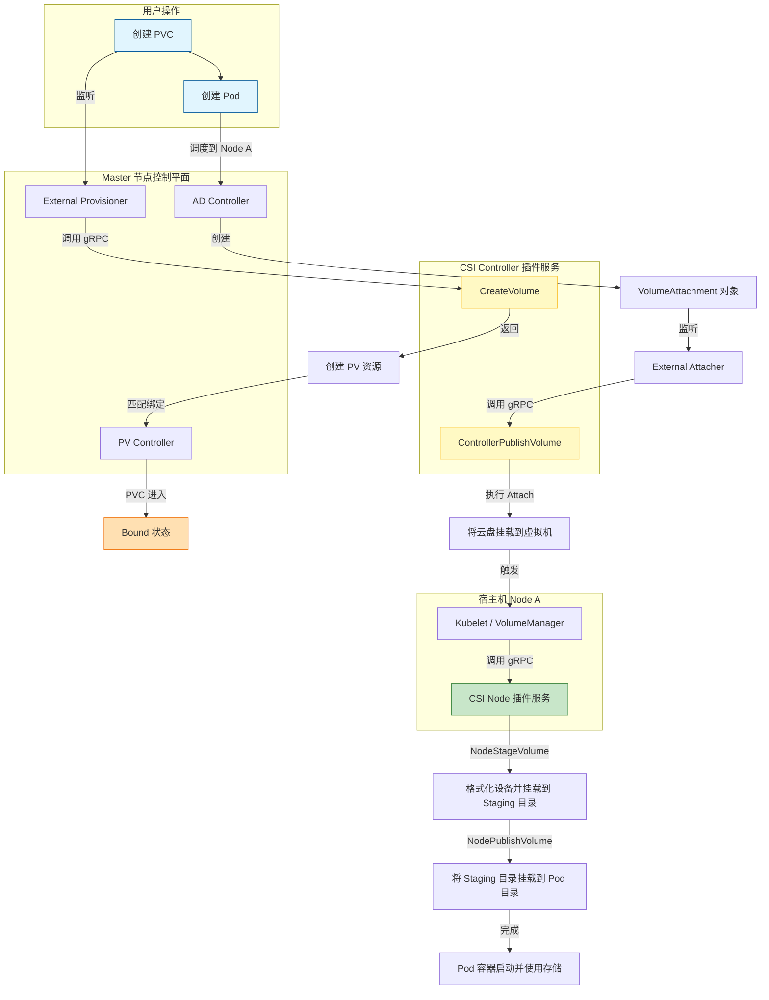
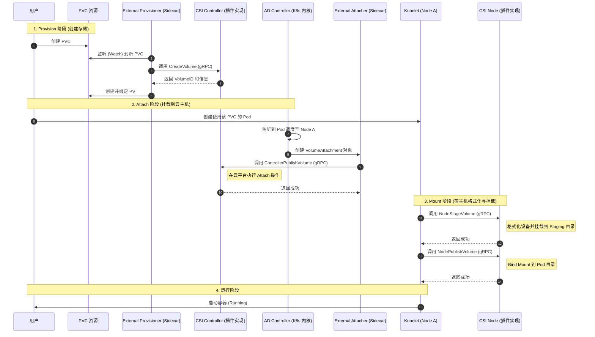

# 2026-02-03 闪念笔记

## 场景
- 阅读：读容器存储实践：CSI插件编写指南

## 瞬时想法
- Volume的机制原理
- StorageClass的yaml文件中通过provisioner来指定使用哪一个CSI插件。
- 需要画一个Provision -> Attach -> Mmount的流程图。
- 使用StatefulSet的特性来保证CSI插件在集群中永远只有一份。
- CSI插件编写指南这一章的总结是一个完整持久化Volume的创建和挂载流程，需要使用ai工具生成一个完整的流程图或时序图。

## 疑问 / 联想
- StorageClass 和 Provisioner到底是什么关系？
- go语言中gRPC是如何使用的？
- External Attacher和CSI Controller是什么关系？是通过Sidecar方式部署的还是位于不同的Pod？
- 绑定挂载的命令是什么？
- `/var/lib/kubelet`中的命令行工具是怎么来的？
- 课后思考题：请根据编写FlexVolume和CSI插件的流程，分析一下什么时候该使用FlexVolume，什么时候应该使用CSI？

## 可能有价值的点（不确定）
- 
