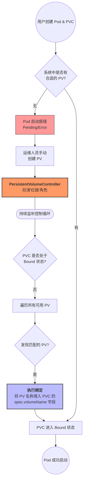

---
tags:
  - k8s
  - 存储
  - pv
  - pvc
  - storageclass
created: 2026-02-05 10:34
---

# PV、PVC、StorageClass简介

## 💡 核心观点
> PVC和PV的原理，以及他们之间绑定关系是如何形成的。Dynmic Provisioning的原理，以及StorageClass的作用。

## 📝 详细笔记
### 1. PV、PVC简介，及PVC和PV的绑定条件
- PV：PV是k8s中的一个API对象，它描述了持久化存储数据卷。
- PVC：PVC也是K8s中的一个对象，它描述了Pod需要使用的PV的一些属性。PVC和PV的关系类似于接口与实现的关系。

PVC和PV绑定的必要条件：
1. PV对象中的capacity.storage必须满足PVC中的resources.requests.storage的大小要求。
2. PVC和PV的storageClassName字段必须一致。

PVC和PV绑定的流程：

### 2. PV对象如何变为容器内的持久化存储(两阶段处理)
如果已经忘记了容器Volume的挂载机制，可以回顾一下[[06-重新认识Docker容器]]。

- **Attach 阶段** 将远程磁盘服务通过设备的形式添加到宿主机本地，有些非远程块设备的服务不需要attach这一步(例如NFS)。
- **Mount阶段** 格式化Attach阶段添加到宿主机的磁盘设备，然后将它挂载到指定的宿主机指定的挂载点上，这个挂载点的目录为`/var/lib/kubelet/pods/<Pod的ID>/volumes/kubernetes.io~<Volume类型>/<Volume名字>`。
- **第一阶段和第二阶段的区分点** Kubernetes可以通过可用参数是nodeName或者dir来进行区分。
- **容器如何挂载上面这个已经挂载到宿主机目录的Volume** kubelet会通过CRI里的Mounts参数将该目录传递给容器实现(例如Docker)，然后docker执行类似如下命令`$ docker run -v /var/lib/kubelet/pods/<Pod的ID>/volumes/kubernetes.io~<Volume类型>/<Volume名字>:/<容器内的目标目录> 我的镜像 ...` 从而实现容器内挂载持久化的Volume。

### 3. 两阶段处理的代码层面实现
- AttachDetachController(第一阶段): 轮询Pod上面的PV是否需要进行Attach/Detach操作。该控制器运行在Master节点上面。
- VolumeManagerReconciler(第二阶段)：因为Mout/Unmount操作是要发生在Pod对应的宿主机上，所以该控制循环必须是kubelet的一部分，但是为了不影响主控制循环，所以该控制循环是一个独立于主控制循环而存在的协程里面运行的。

### 4. StorageClass简介
- Dynamic Provisioning：通过StorageClass作为PV的模版，当k8s里面声明创建PVC的时候，就会根据PVC中的StorageClassName字段对应的StorageClass来创建PV。
- Static Provisionng：手动创建PV的方式。
- StorageClass并不是专门为Dynamic Provisioning为设计的，如果为我们的PV和PVC的storageClassName声明一个不存在对应StorageClass对象的值，其实就是Static Provioning。只有PV和PVC的该字段完全一致才能完成PVC-PV的绑定操作。
- 如果集群没有开启名为DefaultStorageClass的Admission Plugin，而且我们也没有填写对应的StorageClassName字段的话，那默认pvc-pv对象的StorageClass就是""。
- StorageClass的另一个重要作用是：执行PV的Provisioner(存储插件)。

### 5. 小结
![[Pasted image 20260205114605.png]]

---
文章链接:[28 | PV、PVC、StorageClass，这些到底在说啥？-深入剖析Kubernetes-极客时间](https://time.geekbang.org/column/article/42698)