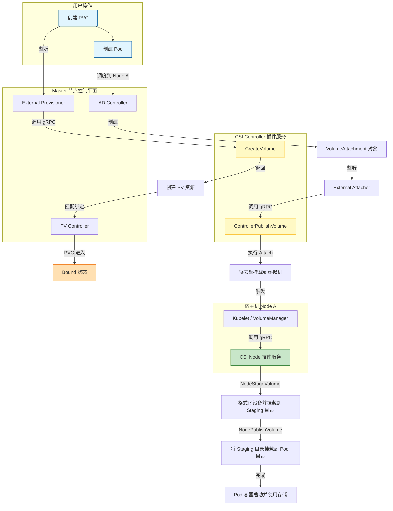
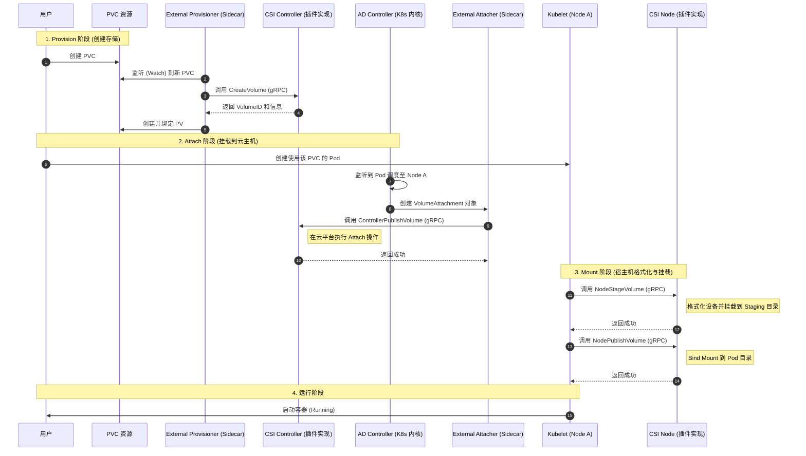

# 26 CSI插件编写指南

## 💡 核心观点
> CSI插件需要用户自行编写的三个服务：CSI Identity、CSI Controller、CSI Node。
> 这三个服务是怎么跟Kubernetes或者kubelet进行交互，一起完成持久化存储的工作流程。

## 📝 详细笔记
### 1. CSI Identity服务
服务接口：
- GetPluginInfo: 返回当前插件的名字和版本号。
- GetPluginCapabilities: 返回这个CSI插件的"能力"。
- Probe接口：用来检查这个CSI插件是否正常工作。
### 2. CSI Controller服务
服务接口：
- CreateVolume/DeleteVolume: 调用插件对应的服务端的能力来创建/删除存储卷。(这两个接口对应的是"Provisioner阶段",调用者是External Provisoner)。
- CtrollerPublishVolume/ControllerUnpublishVolume: 将上面步骤创建的存储卷挂载到宿主机上/移出已挂载到宿主机上的存储卷。(这个两个接口对应的是"Attach阶段"，调用者是External Attacher)。
	- External Attacher的工作原来是：AttachDetachController控制循环，循环检查Pod所对应的PV，以及该POD对应的宿主机上的该PV的挂载情况来决定是否创建VolumeAttachment对象，从而触发监听该VolumeAttachment的External Attacher来调用CSI Contoller来进行Attach/Dettach。
### 3. CSI Node服务
服务接口：
- NodeStageVolume: 格式化Volume在宿主机上的存储设备，然后挂载到一个临时目录(Staging)上。
- NodePublishVolume: 将上面挂载的临时目录绑定挂载到Volume在宿主机上对应的目录上，这样就完成了对该volume目录的"持久化"的处理。

这两个接口是被kubelet的VolumeManagerReconciler调用的，对应的其实是这个控制循环中的两步操作分别叫做：MountDevice和SetUp。
有的时候CSI Node不需要实现NodeStageVolume接口，比如像NFS这种远程文件服务，不存在存储设备，所以只需要实现NodePublishVolume接口。

### 4. 插件部署流程(需要实践)
1. 创建Secret
2. 通过命令部署CSI插件`$ kubectl apply -f https://raw.githubusercontent.com/digitalocean/csi-digitalocean/master/deploy/kubernetes/releases/csi-digitalocean-v0.2.0.yaml`

### 5. 插件部署的常用原则
- 因为需要为kubelet提供CSI Node服务，所以需要通过DaemonSet在每个节点上都启动一个CSI插件。
- 因为要保证CSI在集群中中永远只会有一个提供CSI Controller服务的Pod在运行(保证CSI插件的正确性)，所以需要通过StatefulSet来在任意一个节点上来启动一的CSI插件(StatefulSet的replicas设置为1)。

### 6. 下面是CSI插件运行的流程图和时序图

---
文章链接：[31 | 容器存储实践：CSI插件编写指南-深入剖析Kubernetes-极客时间](https://time.geekbang.org/column/article/64392)