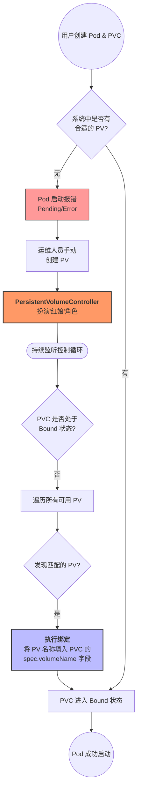

# PVC-PV绑定原理

- 什么时候进行绑定的？(创建Pod的时候进行绑定，绑定成功后，Pod才会被调度器调度到Node上面进行运行)。
- 绑定的流程是怎么样的？(Pod创建时，Master节点上会有一个控制循环--PersistentVolumeController，这个控制循环会循环监测，Pod上面的PVC是否处于bound状态，如果处于没有bound就会去轮询已存在的PV，看是否有可以与PVC进行绑定的PV。该控制循环负责撮合。)，整个流程如下图所示：

- 绑定成功的条件：
	- PVC要求的容量跟PV的容量相匹配
	- PVC的StorageClassname属性跟PV的StorageClassName一致，如果StorageClass存在的话就是PV的创建就不需要运维手动操作(Dynamic Provisioning)，这部分内容请参考[[Dynamic/Static Provioning]]。

---
## 参考文献
- 来源: [[23-PV、PVC、StorageClass简介]]