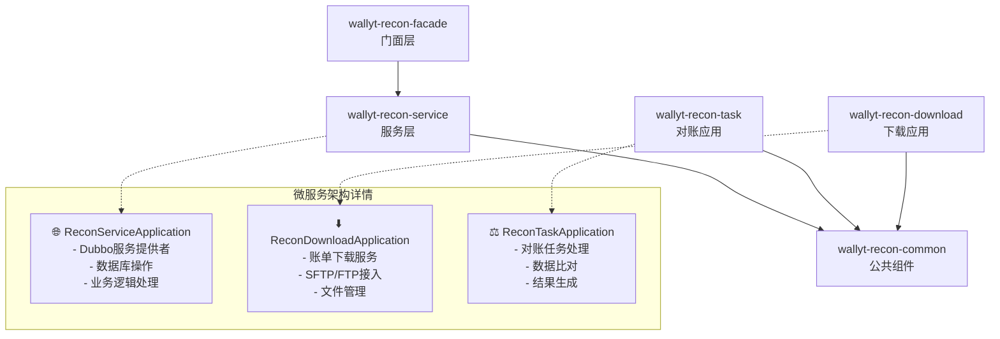
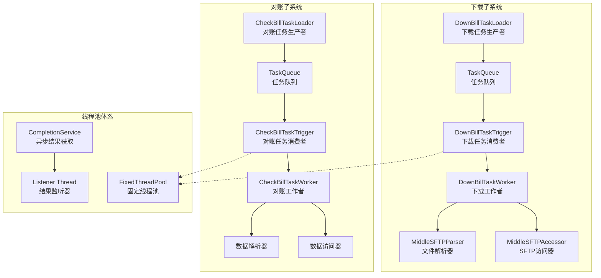
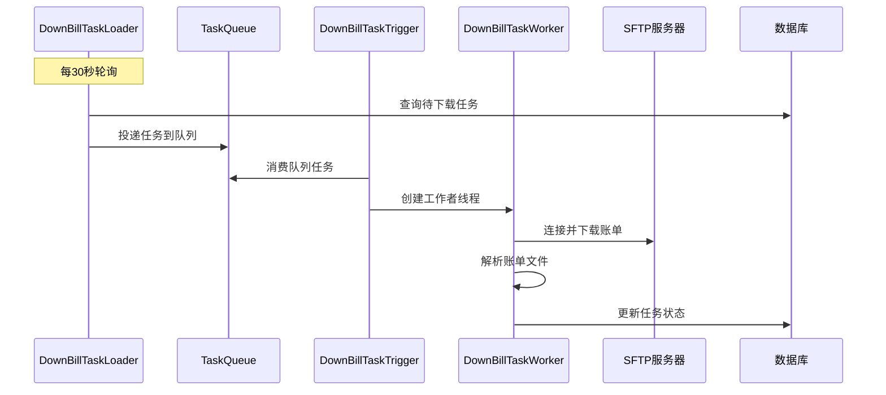
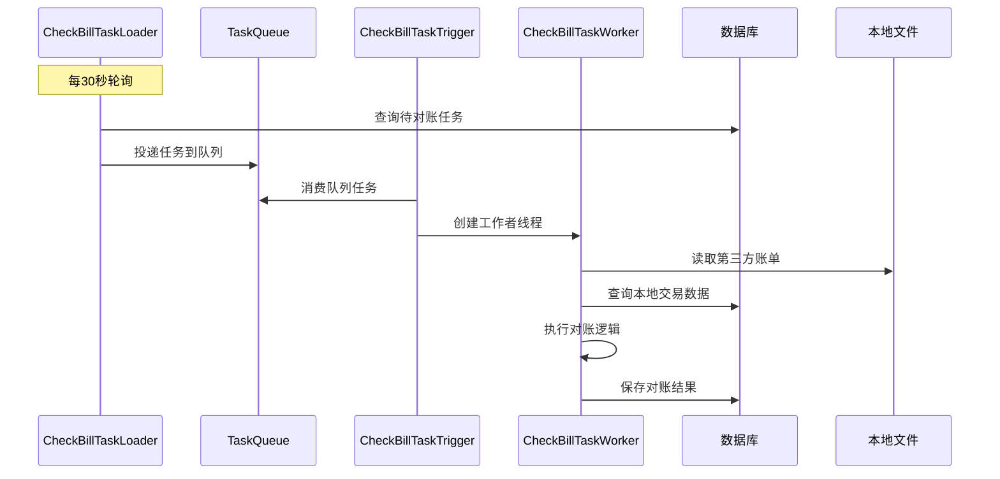
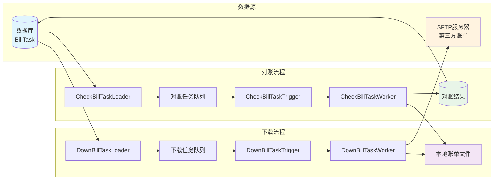

# Wallyt-Recon 对账系统架构全面分析报告

  

## 📋 目录

- [系统概述](#系统概述)

- [系统整体架构](#系统整体架构)

- [主要业务流程](#主要业务流程)

- [线程池架构分析](#线程池架构分析)

- [系统特点分析](#系统特点分析)

- [问题识别与改进建议](#问题识别与改进建议)

- [改进路线图](#改进路线图)

  

## 🎯 系统概述

  

Wallyt-Recon 是一个基于微服务架构的金融对账系统，主要负责处理第三方支付机构的账单下载、数据解析和对账处理。系统采用生产者-消费者模式，通过多线程并发处理来提高对账效率。

  

### 核心功能

- **账单下载**: 从SFTP/FTP服务器下载第三方账单文件

- **数据解析**: 解析各种格式的账单文件

- **对账处理**: 比对本地交易数据与第三方账单数据

- **结果管理**: 生成对账报告和差异处理

  

## 🏗️ 系统整体架构

  

### 模块划分



  

### 模块职责说明

  

| 模块                        | 职责     | 关键组件              |
| ------------------------- | ------ | ----------------- |
| **wallyt-recon-facade**   | 对外接口门面 | DTO、常量、服务接口定义     |
| **wallyt-recon-service**  | 核心业务服务 | 业务逻辑、数据访问、Dubbo服务 |
| **wallyt-recon-download** | 账单下载服务 | SFTP访问器、文件下载器     |
| **wallyt-recon-task**     | 对账任务处理 | 对账逻辑、数据比对         |
| **wallyt-recon-common**   | 公共组件库  | 队列、触发器、工作者框架      |

  

### 核心组件架构



  

## 🔄 主要业务流程

  

### 1. 账单下载流程



  

#### 下载流程关键步骤

1. **任务扫描**: DownBillTaskLoader每30秒轮询数据库，查找待下载任务

2. **任务过滤**: 检查任务状态、重复性、暂停状态等

3. **分布式锁**: 使用Redis锁确保集群环境下任务唯一性

4. **队列投递**: 符合条件的任务投递到TaskQueue

5. **异步执行**: DownBillTaskTrigger消费任务并提交给线程池

6. **文件下载**: DownBillTaskWorker通过SFTP下载账单文件

7. **状态更新**: 更新任务状态并处理执行结果

  

### 2. 对账处理流程



  

#### 对账流程关键步骤

1. **任务扫描**: CheckBillTaskLoader轮询待对账任务

2. **前置检查**: 验证第三方账单文件是否存在

3. **数据库锁**: 使用数据库锁防止任务重复执行

4. **数据读取**: 读取第三方账单和本地交易数据

5. **对账比对**: 执行具体的对账业务逻辑

6. **结果保存**: 生成对账结果并持久化

  

### 3. 完整系统交互流程



  

## 🧵 线程池架构分析

  

### 线程池组件详解

  

#### 1. **TaskTrigger核心线程池**

```java

// 线程池初始化

private void initialize() {

    // 创建固定大小线程池

    threadPool = Executors.newFixedThreadPool(maxRunningTaskNum);

    // 包装为CompletionService，便于异步获取结果

    service = new ExecutorCompletionService<TaskFuture>(threadPool);

    // 启动结果监听器线程（守护线程）

    listener = new Listener(this.taskQueue);

    listener.setDaemon(true);

    listener.start();

}

```

  

#### 2. **任务执行模型**

```java

// 任务提交

while (true) {

    BillTaskDto task = this.taskQueue.peek();

    if (task != null && canExecute(task)) {

        service.submit(getTaskWorker(task));

        this.taskQueue.poll();

    }

    Thread.sleep(1000L);

}

```

  

#### 3. **结果监听机制**

```java

// Listener线程监听任务完成

class Listener extends Thread {

    public void run() {

        while (true) {

            Future<TaskFuture> future = service.take(); // 阻塞获取结果

            TaskFuture result = future.get();

            processResult(result); // 处理执行结果

            cleanupTask(result.getTask()); // 清理任务状态

        }

    }

}

```

  

### 线程池配置参数

  

| 参数 | 下载服务 | 对账服务 | 说明 |

|------|----------|----------|------|

| **队列大小** | 8 (可配置) | 1 (固定) | 下载服务队列较大，对账服务防止抢占 |

| **线程数** | 8 (可配置) | 10 (可配置) | 对账服务线程数较多 |

| **暂停时间** | 5分钟 | 5分钟 | 任务失败后的暂停重试时间 |

  

## ⚡ 系统特点分析

  

### ✅ 优势特点

  

#### 1. **微服务架构**

- **服务拆分**: 下载和对账服务独立部署

- **职责清晰**: 每个服务专注特定业务领域

- **技术栈**: Spring Boot + Dubbo + MyBatis

  

#### 2. **生产者-消费者模式**

- **解耦设计**: 任务生产与消费分离

- **异步处理**: 提高系统吞吐量

- **负载均衡**: 多消费者并发处理

  

#### 3. **多线程并发**

- **线程池**: 使用ExecutorService管理工作线程

- **异步结果**: CompletionService获取任务结果

- **并发控制**: 限制最大并发任务数

  

#### 4. **容错机制**

- **失败重试**: 任务失败后自动暂停重试

- **状态管理**: 详细的任务状态跟踪

- **异常处理**: 分层异常处理机制

  

#### 5. **分布式协调**

- **数据库锁**: 防止任务重复执行

- **Redis锁**: 集群环境下的分布式锁

- **状态同步**: 任务状态实时同步

  

### 📋 架构层次

```

┌─────────────────────────────────────────┐

│            应用启动层                    │

│  ReconServiceApplication                │

│  ReconDownloadApplication              │  

│  ReconTaskApplication                  │

├─────────────────────────────────────────┤

│            任务调度层                    │

│  TaskRunner → TaskLoader → TaskTrigger  │

├─────────────────────────────────────────┤

│            队列管理层                    │

│  TaskQueue (ArrayBlockingQueue)        │

├─────────────────────────────────────────┤

│            线程执行层                    │

│  FixedThreadPool + CompletionService   │

├─────────────────────────────────────────┤

│            业务处理层                    │

│  TaskWorker → Accessor → Parser        │

├─────────────────────────────────────────┤

│            数据访问层                    │

│  Database + SFTP + File System         │

└─────────────────────────────────────────┘

```

  

## 🚨 问题识别与改进建议

  

### 1. 架构设计问题

  

#### 🔴 **严重问题：轮询效率低下**

**问题描述**:

```java

// ❌ 当前实现：数据库轮询

while (true) {

    List<BillTaskDto> tasks = queryPendingTasks();

    if (tasks.isEmpty()) {

        Thread.sleep(30_000); // 空轮询浪费资源

        continue;

    }

}

```

  

**改进建议**:

```java

// ✅ 建议：使用消息队列

@RabbitListener(queues = "recon.task.queue")

public void processTask(BillTaskDto task) {

    // 事件驱动处理

}

```

  

**优势**:

- 消除空轮询，节省CPU资源

- 实时响应，减少处理延迟

- 更好的扩展性和可靠性

  

#### 🔴 **严重问题：并发安全问题**

**问题描述**:

```java

// ❌ 非线程安全的共享状态

public Set<String> runningOrgSet; // 可能导致数据不一致

public volatile Map<String, Date> suspendTaskMap; // volatile无法保证复合操作原子性

```

  

**改进建议**:

```java

// ✅ 使用线程安全集合

public Set<String> runningOrgSet = ConcurrentHashMap.newKeySet();

public ConcurrentHashMap<String, Date> suspendTaskMap = new ConcurrentHashMap<>();

```

  

### 2. 性能优化问题

  

#### 🟡 **线程池配置不合理**

**问题分析**:

- 固定线程池无法动态伸缩

- 队列大小限制可能导致阻塞

- 缺乏拒绝策略处理

  

**改进方案**:

```java

// ✅ 建议：可伸缩线程池

ThreadPoolExecutor executor = new ThreadPoolExecutor(

    corePoolSize,                    // 核心线程数：CPU核数

    maximumPoolSize,                 // 最大线程数：CPU核数*2

    60L,                            // 空闲存活时间

    TimeUnit.SECONDS,

    new ArrayBlockingQueue<>(queueSize), // 有界队列

    new ThreadFactoryBuilder()

        .setNameFormat("recon-worker-%d")

        .setDaemon(false)

        .setUncaughtExceptionHandler(

            (t, e) -> logger.error("线程异常", e))

        .build(),

    new ThreadPoolExecutor.CallerRunsPolicy() // 调用者运行策略

);

```

  

#### 🟡 **队列容量配置问题**

**问题对比**:

| 服务类型 | 当前配置 | 建议配置 | 理由 |

|---------|---------|---------|------|

| 下载服务 | 队列大小8 | 队列大小16-32 | 下载任务IO密集，可适当增大队列 |

| 对账服务 | 队列大小1 | 队列大小8-16 | 过小的队列影响吞吐量 |

  

### 3. 可靠性问题

  

#### 🟡 **异常处理不够完善**

**问题代码**:

```java

// ❌ 问题：异常处理过于粗糙

} catch (Exception e) {

    logger.error("任务加载异常", e);

    continue; // 可能导致任务丢失或状态不一致

}

```

  

**改进方案**:

```java

// ✅ 分类异常处理

} catch (InterruptedException e) {

    Thread.currentThread().interrupt();

    logger.warn("任务加载被中断，准备退出", e);

    break;

} catch (SQLException e) {

    logger.error("数据库访问异常，等待重试", e);

    circuitBreaker.recordException(e);

    Thread.sleep(getBackoffDelay());

} catch (ConnectException e) {

    logger.error("网络连接异常", e);

    notifyAlarm("网络连接失败", e);

    Thread.sleep(60_000);

} catch (Exception e) {

    logger.error("未知异常", e);

    errorCounter.increment();

}

```

  

#### 🟡 **缺乏监控和指标**

**建议添加监控**:

```java

// ✅ 监控指标

@Component

public class ReconMetrics {

    private final MeterRegistry meterRegistry;

    // 任务处理计数器

    private final Counter taskProcessedCounter;

    // 队列大小指标

    private final Gauge queueSizeGauge;

    // 任务执行时间

    private final Timer taskExecutionTimer;

    @ManagedAttribute

    public int getQueueSize() { return taskQueue.size(); }

    @ManagedAttribute

    public int getRunningTaskCount() { return taskQueue.runningTaskNum(); }

    @ManagedAttribute

    public double getTaskSuccessRate() { return successRate.get(); }

}

```

  

### 4. 代码质量问题

  

#### 🟡 **配置硬编码问题**

**问题与解决**:

```java

// ❌ 硬编码

Thread.sleep(1000L * 30);

  

// ✅ 配置化

@ConfigurationProperties(prefix = "recon.task")

@Data

public class ReconTaskProperties {

    private int pollIntervalSeconds = 30;

    private int maxRetryCount = 3;

    private int suspendMinutes = 5;

}

```

  

#### 🟡 **工厂类设计问题**

**问题代码**:

```java

// ❌ 返回null的危险实现

@Override

public Accessor getMyAccessor(BillTaskDto task) {

    return null; // 可能导致NullPointerException

}

```

  

**改进方案**:

```java

// ✅ 策略模式 + 空对象模式

@Component

public class TaskWorkerFactory {

    private final Map<TaskType, TaskWorkerGenerator> generators;

    public TaskWorker createWorker(BillTaskDto task) {

        TaskType taskType = TaskType.fromTask(task);

        TaskWorkerGenerator generator = generators.get(taskType);

        if (generator == null) {

            throw new UnsupportedTaskTypeException(

                "不支持的任务类型: " + taskType);

        }

        return generator.getMyTaskWorker(task);

    }

}

```

  

## 🎯 改进路线图

  

### 短期改进 (1-2周)

| 优先级 | 改进项 | 预期收益 | 工作量 |

|-------|--------|----------|--------|

| 🔴 高 | 修复并发安全问题 | 消除数据不一致风险 | 2人日 |

| 🔴 高 | 优化线程池配置 | 提升20-30%性能 | 3人日 |

| 🟡 中 | 增加关键监控指标 | 提升可观测性 | 5人日 |

| 🟡 中 | 配置参数化改造 | 提升可维护性 | 3人日 |

  

**实施计划**:

1. **第1周**: 并发安全问题修复 + 线程池优化

2. **第2周**: 监控指标添加 + 配置参数化

  

### 中期改进 (1-2月)

| 改进项 | 技术方案 | 预期收益 |

|--------|----------|----------|

| 引入消息队列 | RabbitMQ/Kafka | 消除轮询，提升实时性 |

| 熔断降级机制 | Hystrix/Sentinel | 提升系统可用性 |

| 分布式追踪 | SkyWalking/Zipkin | 改善问题排查效率 |

| 性能测试优化 | JMeter压测 | 确定最优参数配置 |

  

### 长期改进 (3-6月)

| 阶段 | 改进方向 | 技术选型 |

|------|----------|----------|

| **架构升级** | 事件驱动架构 | Spring Cloud Stream |

| **云原生化** | 容器化部署 | Docker + Kubernetes |

| **弹性扩缩容** | 自动伸缩 | HPA + VPA |

| **数据处理** | 流式处理 | Apache Flink |

  

## 📊 总结

  

Wallyt-Recon对账系统采用了较为成熟的微服务架构和生产者-消费者模式，具备良好的基础架构。系统的主要优势在于:

  

1. **清晰的模块划分**: 下载、对账、公共组件分离

2. **成熟的技术栈**: Spring Boot + Dubbo + MyBatis

3. **并发处理能力**: 多线程 + 队列管理

  

但同时也存在一些需要改进的问题:

  

1. **性能瓶颈**: 数据库轮询、线程池配置不当

2. **可靠性风险**: 并发安全、异常处理不完善

3. **可观测性不足**: 缺乏监控指标和分布式追踪

  

通过按照短期、中期、长期的改进路线图实施优化，可以显著提升系统的性能、可靠性和可维护性。建议优先解决并发安全和性能优化问题，然后逐步引入现代化的技术栈和架构模式。

  

---

**文档版本**: v1.0  

**生成时间**: 2024年  

**分析范围**: wallyt-recon 完整模块架构