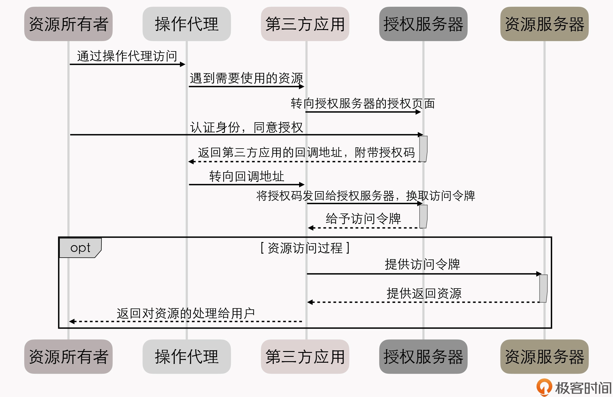
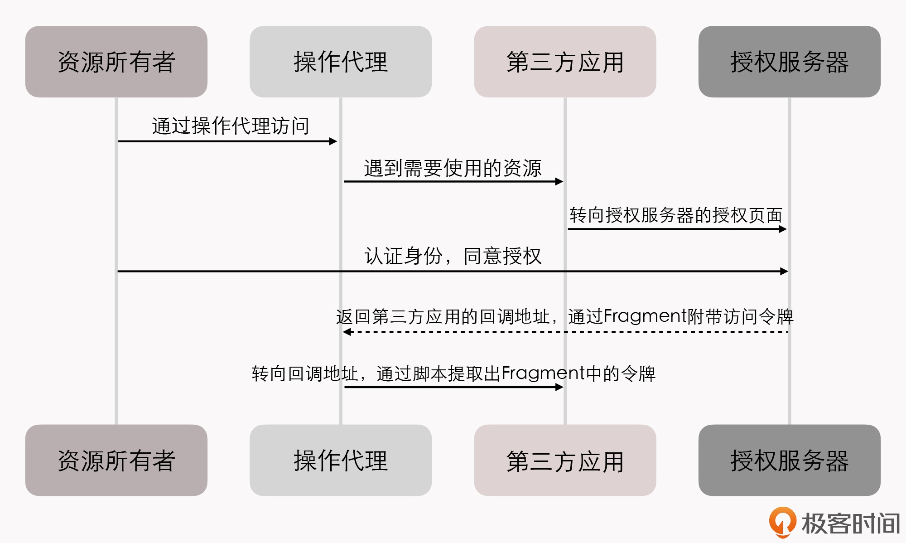
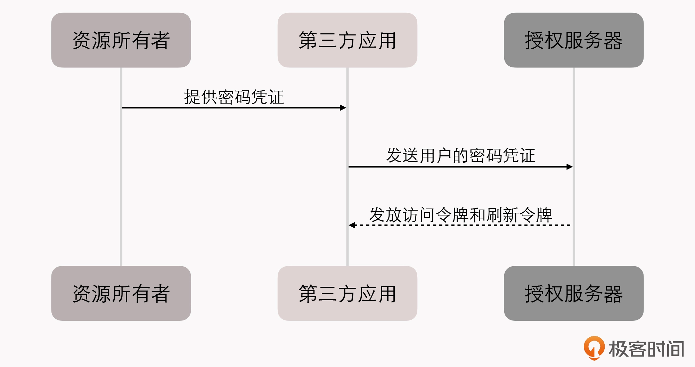
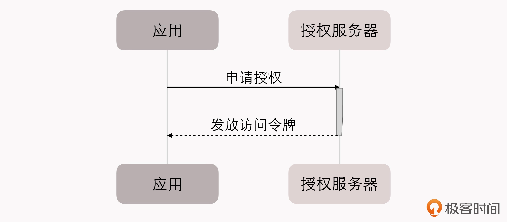
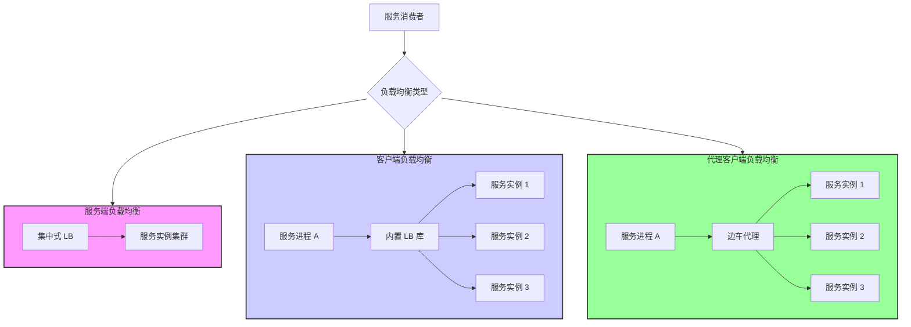

# RPC
>
>RPC 是O一种语言级别的通讯协议，它允许运行于一台计算机上的程序以某种管道作为通讯媒介(即传输协议的网络)，去调用另外一个地址空间(通常为网络上的另外一台计算机)。

几种进程间通讯机制(Inter-Process Communication，IPC)：

- 管道或具名管道(Named Pipe)，管道其实类似于两个进程之间的桥梁，用于进程间传递少量的字符流或字节流。
- 信号(Signal) 信号是用来通知目标进程有某种事情发生的。
- 信号量(Semaphore) 信号量是用于两个进程之间同步协作的手段，相当于操作系统提供的一个特殊变量。
- 消息队列(Message Queue)，消息队列克服了信号承载信息量少、管道只能用于无格式字节流，以及缓冲区大小受限等缺点，但实时性相对受限。
- 共享内存(Shared Memory) 允许多个进程访问同一块内存空间，这是效率最高的进程间通信方式。进程的内存地址空间是独立隔离的，但操作系统提供了让进程主动创建、映射、分离、控制某一块内存的接口。- 本地套接字接口(IPC Socket) 套接字接口，是更jj为普适的进程间通信机制，可用于不同机器之间的进程通信。

## RPC需要解决的三个基本问题

1. 如何表示数据？
将交互上方涉及的数据，转换为某种实现约定好的中立数据流格式来传输，将数据流转换会不同语言中对应的数据类型来使用。**就是序列化与反序列化**
2. 如何传递数据？
准确地说，如何传递数据是指如何通过网络，在两个服务Endpoint之间相互操作、交换数据。这里"传递数据"通常指的是应用层协议，实际传输一般是基于标准的TCP、UDP等传输层协议来完成的。
3. 如何表示方法？
简单的方式是：只要给程序中的每个方法，都规定一个通用的又绝对不会重复的编号；在调用的时候，直接传这个编号就可以找到对应的方法。

## Rest
Rest与RPC在思想上存在差异的核心，是抽象的目标不一样，也就是面向资源编程思想与面向过程的编程思想之间的区别。

Rest，即"表征状态转移" (Representational State Transer)的缩写，REST中的一些关键概念：

- 资源(Resource)
- 表征(Representation)，"表征"这个概念是指信息与用户交互时的表示形式。
- 状态(State)，在特定语境中才能产生的上下文信息就被称为"状态"。- 转移(Transfer)，服务器通过某种方式，把"用户当前阅读的文章"转变成"下一篇章"，这就被称为"表征状态转移".

### RESTFul风格的系统特征

- 服务端与客户端分离(Client-Server)
- 无状态(Stateless)
- 可缓存(Cacheability)
- 分层系统(Layered System)
- 统一接口(Uniform Interface)
- 按需代码(Code-On-Demand)，例如Java Applet、WebAssembly。

### REST提出以主体进行服务设计的风格，为它带来了不少好处

- 降低了服务接口的学习成本
- 资源天然具有集合与层次结构
- REST绑定于HTTP协议

## Richardson成熟度模型(Richardson Maturity Model，RMM)

Richardson将服务接口按照"REST的程度"，从低到高分为0至3共4级：

1. The Swamp of Plain Old XML：完全不REST。
2. Resources：开始引入资源的概念。
3. HTTP Verbs：引入统一接口，映射到HTTP协议的方法上。
4. Hypermedia Controls(超文本驱动)。
![[Pasted image 20250826134455.png]]

### REST的不足与争议

- 面向资源的编程思想只适合做CRUD，只有面向过程、面向对象编程才能处理真正复杂的业务逻辑。（针对那些比较抽象的场景，如果确实不好把 HTTP 方法映射为资源的所需操作，REST 也并不会刻板地要求一定要做映射。这时，用户可以使用自定义方法，按 Google 推荐的 REST API 风格来拓展 HTTP 标准方法。）
- REST与HTTP完全绑定，不适用于要求高性能传输的场景中。
- REST不利于事务支持。
- REST没有传输可靠性支持，应对传输可靠性最简单粗暴的做法，就是把消息再重发一遍。这种简单处理能够成立的前提，是服务具有幂等性(Idempotency)。
- REST缺乏对资源进行"部分"和"批量的处理能力"。如果要在REST上实现"部分"操作的能力，只能自己在GET方法的Endpoint上设计各种参数。而要解决批量操作这类问题，目前一种从理论上看还比较优秀的解决方案是GraphQL。

## 本地事务

ACID中的A、I、D是手段，C是目的，AID具有正交性。

《ARIES: A Transaction Recovery Method Supporting Fine-Granularity Locking and Partial Rollbacks Using Write-Ahead Logging》着重解决了事务的 ACID 三个属性中，原子性（A）和持久性（D）在算法层面上应当如何实现；

而另一篇《ARIES/KVL: A Key-Value Locking Method for Concurrency Control of Multiaction Transactions Operating on B-Tree Indexes》则是现代数据库隔离性（I）奠基式的文章。

### 实现原子性与持久性的实现方式

- Commit Logging（较具代表性的是阿里的 OceanBase）
为了能够顺利的地完成奔溃恢复，在磁盘中写数据就不能像程序修改内存中变量值那样，直接改变某表某行某列的值，必须将修改数据这个操作所需的全部信息(上下文)，以日志的形式先记录到磁盘中。

只有在日志记录全部都安全落盘，见到代表事务成功提交的"Commit Record"后，数据库才会根据日志上的信息对真正的数据进行修改，修改完成后，在日志中加入一条"End Record"表示事务已完成持久化，这种事务实现方法被称为"Commit Logging"。

Commit Logging存在一个巨大的缺陷：所有对数据的真实修改都必须发生在事务提交、日志写入了Commit Record之后，这一点对提升数据库的性能是很不利的。

- Shadow Paging，有点类似于copy on write。
- Write-Ahead Logging(ARIES提出来的)，Write-Ahead其实就是允许在事务提交之前提现写入变动数据的意思。

>Write-Ahead Logging 先将何时写入数据，按照事务提交时点为界，分为了FORCE和STEAL两类：
>
>- **FORCE:** 当事务提交后，要求变动数据必须同时完成写入则称为FORCE，如果不强制变动数据必须同时完成写入则称为NO-FORCE。现实中绝大多数数据库采用的都是NO-FORCE策略，只要有了日志，变动数据随时可以持久化，从优化磁盘I/O性能考虑，没有必要强制数据写入立即进行。
>- **STEAL:** 在事务提交前，允许变动数据提前写入则称为STEAL，不允许则称为NO-STEAL。STEAL有利于利用空闲I/O资源，也有利于节省数据库缓存区的内存。

Write-Ahead Logging允许No-FORCE，也允许STEAL，它给出的解决办法是增加另一种称为Undo Log的日志。当变动数据写入磁盘前，必须先记录Undo Log，写明修改那个位置的数据、从什么值改成什么值，以便在事务回滚或者奔溃恢复时，根据Undo Log对提前写入的数据变动进行擦除。

由于Uno Log的加入，Write-Ahead Logging在奔溃恢复时，会因此经历以下三个阶段：

- **分析阶段(Analysis):** 该阶段从最后一次检查点(Checkpoint，可理解为在这个点之前所有应该持久化的变动都已经安全落盘)开始扫描，找出所有没有End Record的事务，组成待恢复的事务集合(一般包括Transaction Table和Dirty Page Table).
- **重做阶段(Redo)**：该阶段以及分析阶段中，产生的待恢复的事务集合来重演历史，找出所有包含Commit Record的日志，将它们写入磁盘，写入完成后增加一条End Record，然后移除出待恢复事务集合。
- **回滚阶段(Undo)：** 该阶段处理经过分析、重做阶段后剩余的恢复事务集合，此时剩下的都是需要恢复的事务，根据Undo Log中的信息回滚这些事务。
![[Pasted image 20250826172442.png]]

## 本地事务的隔离级别

### **可串行化**

串行化访问提供了强度更高的隔离性,ANSI/ISO SQL-92中定义的最高等级的隔离级别便是可串行化(Serializable)。

可串行化比较符合普通程序员对数据竞争加锁的理解，如果不考虑性能的话，对事务所有读、写的数据全都加上读锁、写锁和范围所即可(这种可串行化的实现方案称为 Two-Phase Lock)。

### **可重复读**

可重复读(Repeatable Read)的意思就是对事务所涉及到的数据加读锁和写锁，并且一直持续到事务结束，但不再加范围锁。

可重复读比可串行化弱化的地方在于幻读问题(Phatom Reads)，幻读问题其实也就是一个事务遭到其他事务的影响隔离性被破坏的表现。

**需要注意**，这里的介绍实际上是以ARIES理论作为讨论目标的，而具体的数据库并不一定要完全遵照这个理论去实现。例如：Mysql/InnoDB的默认隔离级别是可重复读，但它在只读事务中就可以完全避免幻读问题(Mysql中加间隙锁(范围锁的一种实现))。

### **读已提交**

读已提交(Read Commited)对事务涉及到的数据加的写锁，会一直持续到事务结束，但加的读锁在查询操作完成后就马上会释放。

读已提交比可重复读弱化的地方在于**不可重复读(Non-Repeatab Reads)问题**，该问题是指在事务执行过程中，对同一行数据的两次查询得到了不同的结果。

### **读未提交**

读未提交(Read Uncommited)对事务涉及到的数据只加写锁，这会一直持续到事务结束，但完全不加读锁。

读未提交比读已提交弱化的地方在于**脏读问题(Dirty Reads)**，它是指在事务执行过程中，一个事务读取到了另一个事务未提交的数据。

```ad-note
**其实，不同隔离级别以及幻读、脏读等问题都只是表面现象，它们是各种锁在不同加锁时间上组合应用所产生的结果，锁才是根本的原因。**
```

## MVCC基础
>
>针对"一个事务读 + 另一个事务写"的隔离问题，有一种名为"多版本并发控制"（Multi-Version Concurrency Control，MVCC)的无锁优化方案被主流的商业数据库广泛采用。

**MVCC是一种读取优化策略，它的"无锁"是特指读取时不需要加锁。** MVCC的基本思路是读数据库的任何修改不会直接覆盖之前的数据，而是产生一个新版副本与老版本共存，以此达到读取时可以完全不加锁的目的。

不妨将其理解为数据库中每一行记录都存在两个看不见的字段：CREATE_VERSION 和 DELETE_VERSION，这两个字段记录的值都是事务 ID（事务 ID 是一个全局严格递增的数值），然后：

- 数据被插入时：CREATE_VERSION 记录插入数据的事务 ID，DELETE_VERSION 为空。
- 数据被删除时：DELETE_VERSION 记录删除数据的事务 ID，CREATE_VERSION 为空。
- 数据被修改时：将修改视为“删除旧数据，插入新数据”，即先将原有数据复制一份，原有数据的 DELETE_VERSION 记录修改数据的事务 ID，CREATE_VERSION 为空。复制出来的新数据的 CREATE_VERSION 记录修改数据的事务 ID，DELETE_VERSION 为空。

此时，当有另外一个事务要读取这些发生了变化的数据时，会根据隔离级别来决定到底应该读取哪个版本的数据：

- 隔离级别是可重复读：总是读取 CREATE_VERSION 小于或等于当前事务 ID 的记录，在这个前提下，如果数据仍有多个版本，则取最新（事务 ID 最大）的。
- 隔离级别是读已提交：总是取最新的版本即可，即最近被 Commit 的那个版本的数据记录。

**MVCC 是只针对“读 + 写”场景的优化，如果是两个事务同时修改数据，即“写 + 写”的情况，那就没有多少优化的空间了，加锁几乎是唯一可行的解决方案。**

## XA 全局事务

### **两段式提交**

![[Pasted image 20250827151040.png]]
两段式提交有三个非常明显的缺点：

- 单点问题：协调者在两段式提交中具有举足轻重的作用，协调者等待参与者回复时可以有超时机制，允许参与者宕机，但参与者等待协调者指令时无法做超时处理。一旦协调者宕机，所有参与者都会受到影响。如果协调者一直没有恢复，没有正常发送Commit或者Rollback的指令，那所有参与者都必须一直等待。
- 性能问题：两段提交过程中，所有参与者相当于被绑定称为一个统一调度的整体，期间要经过两次远程服务调用、三次数据持久化(准备阶段写重做日志，协调者做状态持久化，提交阶段在日志写入Commit Record)，整个过程将持续到参与者集群中最慢的那一个处理操作结束位置。
- 一致性风险：当网络稳定性和宕机恢复能力的假设不成立时，两段式提交可能会出现一致性问题。

### **三段式提交**

**在事务需要回滚的场景中，三段式的性能通常要比两段式好很多，但在事务能够正常提交的场景中，两段式和三段式提交的性能都很差，三段式因为多了一次询问，性能还要更差一些。**

在三段式提交中，如果协调者在 PreCommit 阶段开始之后发生了宕机，参与者没有能等到 DoCommit 的消息的话，默认的操作策略将是提交事务而不是回滚事务或者持续等待。
![[Pasted image 20250827151902.png]]

## 可靠消息队列

![[Pasted image 20250827170415.png]]
消息表，里面存入一条消息：“事务 ID：UUID；扣款：100 元（状态：已完成）；仓库出库《深入理解 Java 虚拟机》：1 本（状态：进行中）；某商家收款：100 元（状态：进行中）”。注意，这个步骤中“扣款业务”和“写入消息”是依靠同一个本地事务写入自身数据库的。

前面这种靠着持续重试来保证可靠性的操作，在计算机中就非常常见，它有个专门的名字，叫做"最大努力交付"(Best-Effort Delivery)，而"可靠事件队列"有一种更普通的形式，被称为"最大努力一次提交"(Best-Effort 1PC)，意思就是系统会把最有可能出错的业务，以本地事务的方式完成后，通过不断重试的方式(不限于消息系统)来促使同个事务的其他关联业务完成。

可靠消息队列的整个实现过程完全没有任何隔离性可言。

## TCC事务的实现过程

TCC方案，天生适合用于需要强隔离性的分布式事务中。它是一种业务侵入性较强的事务方案，要求业务处理过程必须拆分为"预留业务资源"和"确认/释放消费资源"两个子过程。

TCC的实现过程分为三个阶段：

- Try：尝试执行阶段，完成所有业务可执行性的检查(保障一致性)，并且预留好事务需要用到的所有业务资源(保障隔离性)。
- Confirm：确认执行阶段，不进行任何业务检查，直接使用Try阶段准备的资源来完成业务处理。注意，Confirm阶段可能会重复执行，因此需要满足幂等性。
- Cancel：取消阶段，释放Try阶段预留的业务资源。注意，Cancel阶段也可能会重复执行，因此也需要满足幂等性。
![[Pasted image 20250828111816.png]]
TCC 在业务执行的时候，只操作预留资源，几乎不会涉及到锁和资源的争用，所以它具有很高的性能潜力。常我们并不会完全靠裸编码来实现 TCC，而是会基于某些分布式事务中间件（如阿里开源的Seata）来完成，以尽量减轻一些编码工作量。

由于Try阶段需要业务配合进行冻结(预留资源)的操作，所以对于第三方的调用无法保证他们会配合，所以Try阶段就无法进行下去。

## SAGA事务基于数据补偿代替回滚的解决思路

SAGA由两部分操作组成：

1. 把大事务拆分成若干小事务，将整个分布式事务T分解为n个子事务，我们命名为T1, T2,  ..., Ti, ..., Tn。每个子事务都应该、或者能被看做是原子行为。如果分布式事务T能够正常提交，那么它对数据的影响(最终一致性)就应该于连续按顺序成功提交子事务Ti等价。
2. 另一部分是为每一个子事务涉及对应的补偿动作，我们命名为C1, C2, ..., Ci, ..., Cn。
Ti与Ci必须满足以下条件：

- Ti与Ci都具备幂等性
- Ti与Ci满足交换律(Commutative)，即不管是先执行Ti还是先执行Ci，效果都是一样的；
- Ci必须能够成功过提交，即不考虑Ci本身提交失败被回滚的情况，如果出现就必须持续重试直至成功，或者人工介入。

如果 T1 到 Tn 均成功提交，那么事务就可以顺利完成。否则，我们就要采取以下两种恢复策略之一：

- 正向恢复(Forward Recovery): 如果Ti事务提交失败，则一直对Ti进行重试，直至成功为止(最大努力交付)。
- 反向恢复(Backward Recovery)：如果Ti事务提交失败，则一直执行Ci对Ti进行补偿，直至成功过为止(最大努力交付)。

尽管补偿操作通常比冻结 / 撤销更容易实现，但要保证正向、反向恢复过程能严谨地进行，也需要你花费不少的工夫。比如，你可能需要通过服务编排、可靠事件队列等方式来完成。所以，SAGA 事务通常也不会直接靠裸编码来实现，一般也是在事务中间件的基础上完成。我前面提到的 Seata 就同样支持 SAGA 事务模式。

SAGA同样也需要通过引入语义锁之类的机制来避免并发问题导致隔离性被破坏的情况。

## 基于数据补偿的另一种应用模式：AT事务

它大致的做法是在业务数据提交时，自动拦截所有 SQL，分别保存 SQL 对数据修改前后结果的快照，生成行锁，通过本地事务一起提交到操作的数据源中，这就相当于自动记录了重做和回滚日志

基于这种补偿方式，分布式事务中所涉及的每一个数据源都可以单独提交，然后立刻释放锁和资源。AT 事务这种异步提交的模式，相比 2PC 极大地提升了系统的吞吐量水平。而使用的代价就是大幅度地牺牲了隔离性，甚至直接影响到了原子性。因为在缺乏隔离性的前提下，以补偿代替回滚不一定总能成功。

## 理解透明多集分流系统的设计原则

作为系统的设计者，我们应该意识到不同的设施、部件在系统中，都具有各自不同的价值：

- 有一些部件位于客户端或网路的边缘，能够迅速响应用户的请求，避免给后方的I/O与CPU带来压力，典型的如**本地缓存、内容分发网络、反向代理**等。
- 有一些部件的处理能力能够线性拓展，易于伸缩，可以通过使用较小的代价堆叠机器，来获得与用户数量相匹配的并发性能，并且应尽量作为业务逻辑的主要载体，典型的如**集群中能够自动扩缩的服务节点。**
- 有一些部件的稳定服务，对系统运行具有全局性的影响，要时刻保持着容错备份，维护着高可用性，典型的如**服务注册中心、配置中心**。
- 有一些设施是天生的单点部件，只能依靠升级机器本身的网络、存储和运算性能来提升处理能力，比如位于**系统入口的路由、网关或者负载均衡器** (它们都可以做集群，但一次网络请求中无可避免至少有一个是单点的部件)、位于**请求调用链末端的传统关系数据库等**，都是典型的容易形成单点的部件。

两个简单、普适的原则，能知道我们进行设计：

- **第一个原则是尽可能减少单点部件，如果单点是无可避免的，则应尽最大限度减少到达单点部件的流量。**
- **第二个原则是奥卡姆剃刀原则，如无必要，务增实体。**
**在能满足需求的前提下，最简单的系统就是最好的系统。**

## DNS的工作原理

DNS的解析步骤如下：

- 第一步，客户端先检查本地的 DNS 缓存，查看是否存在并且是存活着的该域名的地址记录。
- 第二步，客户端将地址发送给本机操作系统中配置的本地 DNS（Local DNS）。这个本地 DNS 服务器可以由用户手工设置，也可以在 DHCP 分配时或者在拨号时，从 PPP 服务器中自动获取。
- 第三步，本地 DNS 收到查询请求后，会按照“是否有 <www.icyfenix.com.cn> 的权威服务器”→“是否有 icyfenix.com.cn 的权威服务器”→“是否有 com.cn 的权威服务器”→“是否有 cn 的权威服务器”的顺序，依次查询自己的地址记录。如果都没有查询到，本地 DNS 就会一直找到最后点号代表的根域名服务器为止。

```ad-note
这里涉及两个重要的名词：
1. **权威域名服务器(Authoritative DNS)**: 是指负责翻译特定域名的DNS服务器，"权威"是指服务器决定了这个域名应该翻译出怎样的结果。权威DNS可以用于内容分发网络、服务发现。
2. **根域名服务器(Root DNS)**：是指固定的、无需查询的顶级域名(Top-Level Domain)服务器，可以默认为它们已内置在操作系统代码之中。全世界一共有13组根域名服务器。
```

- 第四步，现在假设本地 DNS 是全新的，上面不存在任何域名的权威服务器记录，所以当 DNS 查询请求按步骤 3 的顺序，一直查到根域名服务器之后，它将会得到“cn 的权威服务器”的地址记录，然后通过“cn 的权威服务器”，得到“com.cn 的权威服务器”的地址记录，以此类推，最后找到能够解释 <www.icyfenix.com.cn> 的权威服务器地址。
- 第五步，通过“www.icyfenix.com.cn 的权威服务器”，查询 <www.icyfenix.com.cn> 的地址记录。这里的地址记录并不一定就是指 IP 地址，在 RFC 规范中，有定义的地址记录类型已经多达几十种，比如 IPv4 下的 IP 地址为 A 记录，IPv6 下的 AAAA 记录、主机别名 CNAME 记录，等等。

DNS的缺陷：

- 响应速度慢
解决方案：前端进行DNS预取，`<link rel="dns-prefetch" href="//domain.not-icyfenx.cn">`。
- DNS的分级查询意味着每一级都有可能受到中间人攻击的威胁，产生被劫持的风险。
解决方案：HTTPDNS，把原本的DNS解析服务开放为一个基于HTTPS协议的查询服务，代替基于UDP传输协议的DNS域名解析。

## 客户端缓存

### 状态缓存

指不经过服务器，客户端直接根据缓存信息来判断目标网站的状态。以前只有301/Moved Permannently(永久重定向)这一种；后来增加了HSTS(Http Strict Transport Security)机制，用来避免301/302跳转https时，可能产生的降级中间人劫持问题。

### 实现强制缓存机制的两类Headers

- 第一类：Expires，它是HTTP/1.0中开始提供的Header，后面跟随一个截止时间参数。当服务器返回某个资源时，如果带有该 Header 的话，就意味着服务器承诺在截止时间之前，资源不会发生变动，浏览器可直接缓存该数据，不再重新发请求。

```shell
HTTP/1.1 200 OK
Expires: Wed, 8 Apr 2020 07:28:00 GMT
```

>Expires存在一些限制：
>
>- 受限于客户端的本地时间
>- 无法处理涉及到用户身份的私有资源
>- 无法描述"不缓存"的语义

- 第二类：Cache-Control，它是 HTTP/1.1 协议中定义的强制缓存 Header，它的语义比起 Expires 来说就丰富了很多。而如果 Cache-Control 和 Expires 同时存在，并且语义存在冲突（比如 Expires 与 max-age / s-maxage 冲突）的话，IETF 规定必须以 Cache-Control 为准。

```shell
HTTP/1.1 200 OK
Cache-Control: max-age=600
```

实际上，在客户端的请求Header或服务器的响应Header中，Cache-Control都可以存在，它定义了一系列的参数，并且允许自行扩展。下面是6种主要的标准参数：
>
>- max-age和s-maxage (单位是秒)
>- public和private
>- no-cache和no-store
>- no-transform
>- min-fresh和only-if-cached
>- must-revalidate和proxy-revalidate

### 协商缓存的两种变动检查机制

- **根据资源的修改时间进行检查**, 它的语义中包含了两种标准参数：Last-Modified 和 If-Modified-Since。

>Last-Modified 是服务器的响应 Header，用来告诉客户端这个资源的最后修改时间。
>
>而对于带有这个 Header 的资源，当客户端需要再次请求时，会通过 If-Modified-Since，把之前收到的资源最后修改时间发送回服务端。
>
>如果此时，服务端发现资源在该时间后没有被修改过，就只要返回一个 304/Not Modified 的响应即可，无需附带消息体，从而达到了节省流量的目的：

```shell
>HTTP/1.1 304 Not Modified
Cache-Control: public, max-age=600
Last-Modified: Wed, 8 Apr 2020 15:31:30 GMT
>```
- **根据资源唯一标识是否发生变化来进行检查**，它的语义中也包含了两种标准参数：Etag 和 If-None-Match。
>Etag 是服务器的响应 Header，用于告诉客户端这个资源的唯一标识。HTTP 服务器可以根据自己的意愿，来选择如何生成这个标识，比如 Apache 服务器的 Etag 值，就默认是对文件的索引节点（INode）、大小和最后修改时间进行哈希计算后而得到的。
>
>然后，对于带有这个 Header 的资源，当客户端需要再次请求时，就会通过 If-None-Match，把之前收到的资源唯一标识发送回服务端。
>
>如果此时，服务端计算后发现资源的唯一标识与上传回来的一致，就说明资源没有被修改过，同样也只需要返回一个 304/Not Modified 的响应即可，无需附带消息体，达到节省流量的目的：
```

HTTP/1.1 304 Not Modified
Cache-Control: public, max-age=600
ETag: "28c3f612-ceb0-4ddc-ae35-791ca840c5fa"

```

### HTTP的内容协商机制
在 HTTP 协议的设计中，一个 URL 地址是有可能提供多份不同版本的资源的，比如说，一段文字的不同语言版本，一个文件的不同编码格式版本，一份数据的不同压缩方式版本，等等。因此针对请求的缓存机制，也必须能够提供对应的支持。

```shell
HTTP/1.1 200 OK
Vary: Accept, User-Agent
```

这个响应的含义是应该根据 MINE 类型和浏览器类型来缓存资源，另外服务端在获取资源时，也需要根据请求 Header 中对应的字段，来筛选出适合的资源版本。

## 传输链路，HTTP的演化

### **1. HTTP/1.x时代的困境与"奇技淫巧"**

- 根本矛盾：HTTP协议(短小快速的资源传输) 与TCP协议(为长连接大数据量设计)之间的不匹配。TCP建立连接的三次握手和慢启动成本很高。
- 优化策略：为环节这个矛盾，前端开发者被迫采用各种技巧：
  - 减少请求数：雪碧图、文件合并、内联资源等。
  - 增加连接数：域名分片，以突破浏览器对单个域名的连接数限制。
- 副作用：这些技巧带来了缓存失效、响应延迟、DNS负担加重、缓存效率下降等新问题，是一种"两害相权取其轻"的无奈选择。

### **2. HTTP/1.x的改进与局限：连接复用**

- 持久连接(Keep-Alive)：复用TCP连接，避免多次握手。但引入了**队首阻塞(Head-of-Line Blocking)** 问题 --- 一个慢请求会阻塞同连接上所有后续请求。
- HTTP管道(Pipelining)：尝试让服务器管理请求队列，但因此实现复杂且未能根本解决队首阻塞，推广失败。

### **3. 革命性的解决方案：HTTP/2的多路复用**

- 核心机制：引入了帧(Frame) 和 流(Stream) 的概念。
  - 帧：最小的数据单位，每个帧都携带一个流ID。
  - 流：一个独立的、虚拟(逻辑上)的请求-响应双向通道。
- 如何解决队首阻塞：在同一个TCP连接上，多个流的帧可以混杂在一起传输，接收方根据流ID重新组装。这意味着一个流的阻塞不会影响其他流。
- 带来的改变：
  - 但域名单链接：彻底摆脱了连接数的限制，域名分片不再需要。
  - 请求合并称为反模式：合并小文件反而会降低缓存效率和传输灵活性。
  - 头部压缩：HTTP/2专门设计了HPACK头部压缩算法，进一步减少了传输开销。

#### **4. 传输压缩与持久化连接的冲突以及解决方案**

- 冲突：现代服务器使用即使压缩以加快首字节时间(TTFFB)，但这导致无法再传输前知道body的准确长度(即无法给出Content-length Header)，这与HTTP/1.1的持久连接机制冲突。
- 解决方案：HTTP/1.1引入了分块传输编码(Chunked Transfer Encoding)，将数据分成若干块一次发送，最后一个零长度的块标记结束，完美解决了这一冲突。

### **5. 面向未来的根本性变革：HTTP/3与QUIC**

- 为什么需要HTTP/3：HTTP/2虽然解决了应用层的对首阻塞，但底层依然基于TCP。TCP协议本身的机制(丢失重传)会导致传输层的队首阻塞 --- 一个TCP包丢失会阻塞所有流。
- 核心：HTTP/3弃用TCP，代用基于UDP的QUIC协议。
- QUIC的优势：
  - 解决队首阻塞：在QUIC层实现了可靠的传输，每个流独立处理，彻底解决了所有层面的队首阻塞。
  - 极快的连接建立：继承了TLS1.3，通常只需要0-RTT或1-RTT即可完成建连和加密握手。
  - 连接迁移：使用连接ID而非IP地址来标识连接，网络切换(如Wifi换4G)时连接不会中断。

## CDN

### **一、CDN的本质与价值**

- 解决的核心问题：主要改善网络传输速度，针对以下三点：

 1. 网站服务器出口带宽：分流，减轻原站压力。
 2. 跨运营商互联点带宽：优化跨网访问
 3. 物理链路传输时延：通过就近访问降低延迟

- 用户客户端入口带宽无法通过CDN改善，需用户自行升级。

### **二、CDN的工作原理**

1. **路由解析(依靠DNS实现)**

- 流程：
- 将原站IP在CDN服务商注册，获取一个`CNAME`记录
- 在域名DNS服务商处，为该域名配置这条`CNAME`记录
- 用户首次访问时，本地DNS查询最终被只想CDN服务商的权威DNS服务器
- CDN的DNS根据策略(拓扑、容量、时延等)返回最合适的CDN缓存节点IP给用户。
- 用户直接访问该CDN节点获取资源。
- 关键：对用户和源站(几乎)时透明的。

2. **内容分发(如何获取和管理资源)**

- 两种分发方式：
- 主动分发(Push)：需要源站主动将资源推送到CDN节点，需API配合。
- 被动回源(Pull)：用户请求未命中缓存时，CDN节点实时从源站拉取资源。
- 资源管理(更新)策略：
- 无统一标准，常见结合两种方式：
- 超时被动失效: 为缓存设置生存时间(TTL)
- 手动主动失效：通过CDN提供的API接口主动刷新缓存(常与持续集成流水线结合)

### **三、CDN的广泛应用**

1. 加速静态资源
2. 安全防御：作为源站的堡垒机，有效抵御DDos等攻击。
3. 协议升级：

- HTTP源站 -> HTTPS对外服务
- HTTP/1.x -> HTTP/2/3
- IPv4 -> IPv6

4. 状态缓存：缓存源站状态码。
5. 修改资源：
1. 自动压缩资源 + 修改  `Content-Encoding`
2. 为资源添加缓存Header
3. 修改CORS Header实现跨域
6. 访问控制：
1. IP黑/白名单那
2. 根据IP提供不同响应、QoS控制、防盗链
7. 注入功能

## 四层和七层负载均衡

### **1. 负载均衡的两种形式与总体印象**

- 四层负载均衡：工作于OSI模型的传输层。优势是性能高，因为它通常维持同一个TCP连接，只处理底层(如IP、端口)的转发。
- 七层负载均衡：工作于OSI模型的应用层。优势是功能强大，它能解析HTTP等应用层协议内容，从而做出更智能的决策。
- 关键原则：在实际架构中，通常采用多级混合负载均衡，并且是低层(四层)在前，高层(七层)在后。这样可以用四层处理大量流量，七层处理更复杂的业务逻辑。

### **2. 常见的四层负载均衡工作模式**

它们都维持客户端到服务器的同一个TCP连接。

1. 数据链路层负载均衡(三角传输/直接路由-DSR)

- 工作原理：修改传入数据帧的目标MAC地址，直接转发给后台的真实服务器(Real Server)。
- 要求：负载均衡器和所有真实服务器必须配置相同的虚拟IP(VIP)，且必须在同一个子网内(二层可达)。
- 最大优点：响应数据包不需要经过负载均衡器，可以直接返回给客户端，性能及高。
- 缺点：不能跨VLAN，网络约束大。

2. 网络层负载均衡 - IP隧道模式

- 工作原理：将原始数据包整个作为新数据包的Payload，通过IP隧道封装转发给真实的服务器。服务器收到后需要拆包。
- 优点：可以跨越VLAN。同样具备三角传输特性，响应可以直接返回给客户端。
- 缺点：仍需配置VIP，封装和解包带来额外性能开销。

3. 网络层负载均衡 - NAT模式

- 工作原理：直接修改数据包头的目标IP地址，将其改为真实服务器的IP。
- 最大问题：响应必须返回给负载均衡器，由它修改源IP后再发给客户端。这使得负载均衡器容易成为带宽瓶颈。
- 变种SNAT：连源IP也修改，对服务器更透明，当服务器无法获取客户端的真实IP。
- 优点：配置简单(服务器网关指向均衡器即可)，不需要VIP。

### **3. 七层负载均衡(应用层负载均衡)**

- 本质是反向代理：客户端与负载均衡器、负载均衡器与真实服务器之间是两条独立的TCP连接。
- 性能对比：性能低于四层模式，因为需要完整的TCP代理和应用层解析，消耗更多CPU。
- 功能强大：因其感知应用内容，可实现：
  - 智能路由：根据URL、Cookie、用户身份等路由请求。
  - 流量优化：静态资源缓存、SSL卸载、压缩等。
  - 安全防护：抵御SYN Flood等DDos攻击，过滤SQL注入等应用层攻击。
  - 链路治理：实现服务降级、熔断等微服务治理策略。

### **4. 均衡策略与实现**

- 常见策略：轮询、加权轮询、随机、加权随机、一致性哈希、响应速度、最少连接数等。
- 实现方式：
  - 软件均衡器：
    - 内核态：如LVS(性能好)。
    - 应用态：如NGINX、HAProxy(功能丰富，使用方便)。
  - 硬件均衡器：如F5、A10，采用专用芯片(ASIC)，性能更高。

## 服务端缓存(进程内缓存)

### **一、引入缓存的理由与风险**

- 目的：主要为缓解CPU压力(如存储计算结果、复用数据)和缓存I/O压力(如将磁盘/网络访问转为内存访问)。
- 风险：引入缓存会增加系统复杂度(需考虑失效、更新、一致性)、增加运维难度(可能掩盖缺陷、延迟问题暴露)、带来安全隐患(可能泄露保密数据)。

### **二、缓存的关键属性**

1. **吞吐量(Throughput)**

- 衡量并发读写效率(OPS)。高并发场景下，不同缓存方案的吞吐量差异显著(最高最低可差一个数量级)。
- 优化手段：避免数据竞争是关键。以Caffine为例，其采用异步日志提交机制(读取状态变更写入专用环形缓冲Ring Buffer，由后台线程异步处理，容忍部分状态丢失)来减少锁竞争，使其读取性能接近ConcurrentHashMap，写入性能约低10%。

2. **命中率(Hit Rate)**

- 命中率直接决定引入缓存的价值。
- 核心问题是淘汰缓存(决定那些数据是"低价值"的):
- FIFO：淘汰最早进入的数据。实现简单，但效果往往较差，可能误伤热点数据。
- LRU：淘汰最久未访问的数据。在java中可以采用HashMap + LinkedList实现，适合处理短期热点，但可能因近期未访问而误伤"老热点"。
- LFU：淘汰访问频率最低的数据，需要维护计数器，开销大且难以应对热度变化(旧数据计数器难衰减)。
- 高级改进算法(如TinyLFU、W-TinyLFU)：
- TinyLFU：采用Count-Min Sketch算法 (类似布隆过滤器) 用少量空间估算频率，并结合时间衰退算法定期减半计数器，解决旧热点问题。
- W-TinyLFU：结合LRU和LFU。新增数据先进入一个小的LRU Window Cache，积累热度后再经TinyLFU筛选进入主缓存(Segmented LRU)，更好地应对突发稀疏访问。
- 高级算法(如W-TinyLFU，ARC，LIRS) 在多数场景下命中率更接近理想状态，远优于基础策略。

3. **扩展功能(Extended Features)**

- 加载器(CacheLoader)：支持主动加载数据，是实现自动刷新的基础。
- 多种淘汰策略：可供选择。
- 失效/刷新策略：支持基于时间的自动失效或刷新。
- 时间通知：支持监听数据移除、刷新等时间。
- 并发级别设置：对于分段锁缓存(如Guava Cache)，可调整并发段数。
- 容量控制：支持设置初始容量和最大容量。
- 引用方式：支持软引用、弱引用，与JVM GC联动。
- 统计信息：提供命中率、平均加载时间等统计。
- 持久化：分布式缓存常支持将数据持久化到数据库或磁盘，但是对于进程内缓存，一般不需要。

## 分布式缓存

### ***一、分布式缓存的两种主要形式*

1. 负值式缓存

- 每个节点存储完整数据副本，读取快(无网络开销)，但写入性能随着节点增加急剧下降。
- 代表产品：JBossCache、Infinspan
- 适合场景：读多写少的数据。

2. 集中式缓存

- 数据集中存储，读写均需网络访问，但扩展性好，适合异构系统。
- 代表产品：Redis。
- 使用场景：读写均频繁的数据。

### **二、透明多级缓存(TMC)**

- 结合进程内缓存(一级) 和分布式缓存(二级)，提升性能的同时减少网络开销。
- 设计原则：
  - 变更以分布式缓存为准。
  - 访问优先读取一级缓存，未命中再读取二级缓存。
  - 通过消息通知(如Redis PUB/SUB或Zookeeper/Etcd)同步一级缓存失效。

### **三、缓存常见风险及应对策略**

1. 缓存穿透(查询不存在的数据)

- 原因：业务逻辑缺陷或恶意攻击。
- 解决：
- 缓存空值(短时间有效，等有值了再更新缓存)。
- 使用布隆过滤器快速判断数据是否存在。

2. 缓存击穿(热点数据突然失效)

- 解决：
- 加锁(互斥锁或分布式锁)，只允许一个请求重建缓存。
- 手动管理热点数据(避免自动失效)

3. 缓存雪崩(大量数据同时失效)

- 解决：
- 提升缓存系统可用性(集群部署).
- 采用多级缓存(分散过期时间)。
- 设置随机过期时间(避免)

4. 缓存污染(数据不一致)

- 原因：缓存更新不规范。
- 解决：采用Cache Aside模式：
- 读：先读缓存，未命中读数据库并回填。
- 写：先写数据库，再失效缓存(而非更新)。

## 系统认证技术：原理、标准与实现

### **一、认证的基本概念**

认证(Authentication) 是系统安全的第一道防线，核心任务是解决"你是谁"的问题，即确认操者的身份。它与授权(Authorization，解决"你能做什么")、凭证(Credentials，解决"你如何证明")、保密(Confidentiality)、传输安全(Transport Security)和验证(Verification)共同构成了软件架构安全的基础。

### **二、认证的主要方法和技术**

认证可以根据其发生的位置和方式分为三种层面：

1. 通讯信道上的认证：在建立通信连接之前验证身份，如基于SSL/TLS的认证。
2. 通讯协议上的认证：在请求资源之前验证身份，即HTTP认证框架。
3. 通讯内容上的认证：在使用服务之前验证身份，即Web认证(如表单登录和新兴的WebAuthn)。

**基于通讯协议的HTTP认证**

| 认证方案 | 基本原理 | 安全性 |
| --------------- | --------------- | --------------- |
| Basic | 用户名和密码经过Base64编码后传输 | 非常低，相当于铭文传输 |
| Digest | 对用户名、密码、服务器提供的Nonce值进行哈希处理 | 较低，仍可能受到中间人攻击 |
| Bearer | 基于OAuth2.0协议的令牌机制 | 高，依赖于令牌的安全性和传输加密 |
| HOBA | 基于自签名证书的认证 | 高，依赖于公钥基础设置(PKI) |
| AWS4-HMAC-SHA256 | 亚马逊AWS使用的基于HMAC-SHA256 | 高 |
| NTLM/Negotiate | 微软Windows NT LAN Manager认证协议 | 中等 |

**基于通讯内容的Web认证**
这是目前最常见的方式，尤其时表单认证(Form Authentication)。其优点时灵活自由，开发者可以抗旨登录页面的样式/交互逻辑等。但其背后通信的安全保障(如防窃听、防篡改)人需遵循成熟的标准和最佳实践。

**WebAuthn** 是新一代Web认证标准，它彻底摒弃密码，改用生物识别或物理安全密钥作为凭证。其核心流程是：

1. 注册：服务其生成Challenge(随机字符串)和用户ID发送给客户端。用户设备上的验证器(Authenticator)生成非对称密钥对，私钥本地安全存储，公钥签名后的Challenge发回服务器存储。
2. 登录：服务器再次下发Challenge。用户使用注册时的私钥对challenge签名并返回。服务器用存储的公钥验证签名，确认用户身份。

WebAuthn的优势在于极强的安全性(避免密码泄露和钓鱼攻击)和便捷性(无需记忆密码)。

### **三、认证的标准与规范**

- HTTP认证框架(RFC 7235)
- OAuth 2.0 / OIDC：用户授权的框架，也常被用于认证(如社交登录)。
- WebAuthn：由W3C和FIDO联盟指定的无密码认证标准。
- JAAS(Java Authentication and Authorization Service)：Java早期的安全规范，提出了许多核心概念(如Subject，Principal)，但因复杂性和与容器绑定过紧而未被广泛应用。

### **四、认证的安全考虑和最佳实践**

- 传输安全：无论使用何种安全认证方案，都必须通过HTTPS(SSL/TLS)来加密传输过程，防止凭证在传输中被窃听或篡改。
- 密码安全：如果使用密码，服务器端不应该存储明文密码，而应该存储经过加盐哈希处理后的值。
- 会话管理：认证成功后生成会话标识需安全管理，如设置合理的过期时间、防止泄露。
- 防范常见攻击：需采取措施防范重放攻击(可通过Nonce/时间戳)、CSRF攻击、XSS攻击(防止Token被窃取)等。

### **五、认证技术的未来发展趋势**

- 无密码：像WebAuthn这样的标准
- 多因素认证(MFA)：结合多种不同因素的认证方式(如密码+手机验证)
- 分布式与标准化：在微服务、云原生架构中，认证技术趋向于标准化(如OIDC)，并将认证功能外置到专门的API网关或服务网格中统一处理。

## 授权

### **1.授权概念与AAA框架**

- 授权解决 "你能干什么" 的问题，通常认证(Authentication)、审计(Audit)、和账号(Account)共同构成AAA框架。
- 授权分为两个主要问题：
  - 确保授权过程可靠
  - 确保授权结果可控

### **2.授权协议：OAuth2.0**

- **OAuth2.0**是解决多方系统中第三方应用安全授权的标准协议，常见于允许第三方应用访问资源时避免密码泄露等问题。
  - OAuth2.0通过使用令牌(Token)代替密码，避免了密码泄露的风险。
  - 令牌具有独立性：每个应用拥有自己的令牌，令牌失效不会影响其他应用。

### **3.OAuth2.0授权模式**

OAuth2.0提供四种授权方式：

- **授权码模式(Authorization Code)**: 使用于需要高安全性的场景，过程包括先获取授权码，再通过授权码换取令牌。适合具有服务端支持的应用，避免令牌泄露。

- **隐式授权模式(Implicit)**: 简化了授权过程，不需要使用授权码，而是直接返回令牌。适合浏览器或客户端应用，但安全性相对较低，尤其容易受到中间人攻击。

- **密码模式(Password Credentials)**: 将认证于授权整合到一个步骤，适用于用户高度信任的第三方应用。风险较大，因为第三方需要获取用户密码。

- **客户端模式(Client Credentials)**: 适用于服务间通信，无需用户参与。常用于微服务架构中，服务通过自身的身份访问资源。


### **4.安全考虑与设计**

- 授权码模式具有较高的安全性，避免了令牌在传输过程中的泄露。
- 隐式授权虽然简化了过程，但因省略了授权码的交换步骤，令牌更容易被泄露。
- 密码模式虽然简单，但第三方应用必须高度可信。
- 客户端模式适用于服务将认证，但不涉及用户身份。

### **5.令牌的结构与功能**

- 令牌(如JWT)是OAuth2.0的核心，用于代替密码，通常包括：
  - Header: 令牌的类型和签名算法
  - Payload: 包含发行人、过期时间、用户信息
  - Signature: 用于验证令牌的签名
- 令牌有时限性，并通过刷新令牌(Refresh Token)来延续访问权限。

### **6.设备码模式(Device Code)**

- 适用于无输入能力的设备(如打印机、电视等)，通过用户在其他设备输入用户码来授权。而授权则决定用户能访问什么资源。

## RBAC(基于角色的访问控制模型)

### **1. RBAC的核心思想与要解决的问题**

- 根本问题：所有访问控制模型都在解决"谁(User)拥有什么权限(Authority)去操作(Operation)哪些资源(Resource)"。
- 核心矛盾：在复杂系统中，直接将权限分配给用户会导致配置量巨大、容易出错。
- RBAC的解决方案：引入角色(Role)作为中间层，解耦用户和权限的直接关联。权限分配给角色，用户通过扮演角色来间接获得权限。

### **2. RBAC得关键该概念与关系**

- 用户
- 角色
- 权限(允许对资源进行某种操作的抽象权力)
- 许可(是权限的具象化实力，对哪些资源进行何种操作)
- 关系(操作和资源的组合)

### **3. RBAC的优势与原则**

- 实现最小特权原则：只给角色分配完成其职责的最小权限集合
- 灵活性与可管理型:
  - 角色继承
  - 角色互斥

### **4. 访问控制的两种类型**

- 垂直权限：也成为功能权限
- 水平权限：也成为数据权限

## 凭证：系统如何保证与用户之间的承诺是准确完整且不可抵赖的？

### 1.HTTP 的无状态管理需求

- HTTP协议本质是无状态的，每隔请求独立，这简化了协议但是不符合需要识别用户身份的实际应用场景。
- 为了解决此矛盾，引入了状态管理机制。

### 2.传统方案：Cookie-Session机制

- **工作原理**：服务器通过`Set-Cookie`头向客户端发送一个唯一标识符(如`sessionid`),客户端后续请求自动附上此Cookie。服务器以此ID为Key，在服务端存储用户状态信息。
- **优势**：
  - 安全性高：敏感状态信息存于服务端，不易在传输中泄露或篡改。
  - 控制力强：服务端可主动管理回话，如强制用户下线。
- **分布式环境下的挑战(CAP困境)**：
  - 当服务需要水平扩展时，Session的存储面临三难选择：
    - 牺牲一致性：采用亲和式负载均衡，但节点宕机会导致回话丢失。
    - 牺牲可用性：节点间同步Session，但同步成本高。
    - 牺牲分区容错性：使用集中式存储Session，但该存储点成为单点故障源。

### 3. 现代方案：JWT

- 定位：并非完全替代Cookie-Session，而是专门用于解决认证授权问题的无状态凭证。
- 工作原理：将用户信息(Payload)经过数字签名后形成一个令牌(Token)。该令牌由客户端保存并在请求时发送给服务端。服务端通过验证签名来信任令牌中的信息。
- 结构：分为三部分，用`.`分隔：
  - Header：说明令牌类型和签名算法。
  - Payload：鞋带需要传递的信息(如用户身份、权限)。
  - Signature：对前两部分的签名，确保信息未被篡改。
- 优势：
  - 无状态/水平扩展友好：服务端无需存储会话状态，可轻松扩缩容。
  - 适用于多方系统：通过非对称加密，资源服务可独立验证令牌真伪。
- 缺陷：
  - 令牌难以主动失效：一旦签发，在过期前一直有效，实现"踢人下线"等功能需引入"黑名单"等有状态逻辑。
  - 易受重放攻击：解决起来较复杂，通常建议在HTTPS信道层面解决。
  - 数据承载量有限：受HTTP Header 大小限制。
  - 客户端存储安全：令牌在客户端(如localStorage)的存储有泄露风险。
  - 无状态的副作用：实现如"在线用户统计"等功能变得困难。

### 小结

- 权衡是关键：没有绝对完美的方案，架构设计需要根据具体场景进行权衡。
  - Cookie-Session在单体架构或服务端控制力要求高的场景下依然非常优秀。
  - JWT在微服务、分布式、需要无状态水平扩展的场景下优势明显，但要接受其固有的缺陷。
- 混合策略是常态：在实践中，常会根据不同需求混合使用这两种技术，甚至引入其他方案(如将短期JWT与状态化的刷新令牌结合)。
- 安全是系统工程：无论那种方案，都需要结合HTTPS、安全的秘钥管理、合理的令牌有效期等共同构建。

## 保密：加密和解密

### 核心观点

1. 安全是连续值，而非二元选项：保密强度需要根据系统需求在安全性与成本之间平衡。并非所有系统都需要无限拔高安全等级。
2. 客户端加密的意义有限：
  a. 为防御传输过程中的窃取而进行客户端加密没有太大意义，因为网络链路本身不安全，易受中间人攻击，无法替代HTTPS的作用。
  b. 但客户端加密可防止密码在服务端被滥用(如拖库后明文泄露)，因此从服务端安全角度仍有价值。
3. 服务端密码存储是关键：真正的防御应聚焦与服务端，通过加密存储防止批量密码泄露，而非依赖客户端加密提升传输安全。

### 保密强度分级

以下列举了逐步升级的保密手段，展示安全强度与成本的平衡：

- 简单哈希摘要：防御基本泄露，但弱密码易受彩虹表攻击。
- 加盐哈希：应对弱密码，但无法防止冒认。
- 动态盐值：防止冒认，但难以组织重放攻击。
- 动态令牌：防止重放攻击，但无法防御嗅探。
- HTTPS：防御链路嗅探和重放攻击，但有证书风险等弱点。
- 更高强度手段：如U盾、双重验证、专用内网，代价更高但更安全。
- 绝对安全：一次性密码(One Time Password) 理论绝对安全，但互联网场景不可行。

### 客户端加密的争议

- 传输安全：客户端加密无法解决链路不安全问题，中间人攻击可篡改页面或代码，使加密措施失效。
- 服务端滥用防御：客户端加密可今早消灭明文密码，避免服务端存储或日志记录明文，降低拖库风险。
- 动态盐值：在客户端动态加盐通常得不偿失，无法替代HTTPS，且增加复杂度。

### 服务端密码存储与验证实践

以Fenix's Bookstore为例，介绍普通安全强度系统的密码处理流程：

1. 客户端处理：
  a. 输入明文密码
  b. 进行哈希摘要(如MD5，SHA256)，再加盐(固定或伪动态盐值)。
  c. 使用慢哈希函数(如BCrypt)增加破解成本(控制计算时间)。
2. 服务端存储：
  a. 为每隔密码生成随机盐值(使用CSPRNG，如Java的SecureRandom)。
  b. 将客户端哈希值与随机盐值再次哈希(服务端可以使用慢哈希函数，但是cost要比较小，不然会影响服务端的性能)，存储最终密文和盐值。
  c. 服务端避免使用慢哈希函数，以节省资源。
3. 验证过程：
  a. 客户端发送加密后的哈希值。
  b. 服务端用存储的盐值重新计算哈希，与数据库比对。

### 保密小结

- 架构设计权衡：安全措施需结合系统实际，平衡强度与性能。例如，普通系统配合HTTPS和密码规则即可防御多数风险。
- 服务端责任：密码加密存储应在服务端完成，重点防御拖库后的批量泄露。
- 客户端角色：客户端加密主要用于防止服务端滥用，而非传输安全。

## 传输安全

### 1. 哈希摘要

- 特点：具有易变性(输入微小改变会导致输出巨变)和不可逆性(无法从摘要结果反推原始输入)。
- 作用：主要用于验证信息完整性，确保数据未被篡改。它本身不是加密。(只是有些地方会将其用来做加密)

### 2. 加密算法

- 对称加密：加解密使用同一秘钥。有点是速度快，适合大量数据加密；缺点是秘钥分发和管理困难。
- 非对称加密：使用公钥和私钥配对。优点是解决了密钥分发难题；缺点是计算复杂性，性能慢，无法直接加密大量数据，加密的内容的长度不能超过私钥的长度。
- 实际应用：通常采用混合加密(如TLS/SSL)，即用非对称加密安全地协商一个临时密钥，再用对称加密来高效传输大量数据。

### 3. 数字签名

- 原理：结合了摘要和非堆成加密。先对信息做哈希摘要，再用私钥对摘要进行加密。验证者用对应的公钥解密签名，再与计算出的摘要对比，一致则说明信息完整且来自私钥持有者。
- 目的：用于身份认证(不可抵赖)和防止信息篡改。

下面是汇总了前面三种与密码学相关的应用，可以去深入理解它们的主要特征、用途和局限性：


## 数字证书
>
> **核心论点**: 在网络世界"一切皆不可信"的假设下，通过数字证书解决公钥的可信分发问题，再通过传输安全层(TLS/SSL)将复杂的安全过程自动化、对应用透明，最终实现了安全的网路通信(如HTTPS)。
>
### 1. 数字证书：如何建立共同信任？

- 问题根源：数字签名需要分发公钥，但如何确保公钥在分发过程中不被篡改？
- 解决方案：引入受信任的第三方---数字证书认证中心(CA)。
- 工作原理：
  - CA充当公证人：CA用自己的私钥对服务端的公钥及相关信息进行签名，生成数字证书。
  - 预置根证书：操作系统和浏览器出厂时已预置了受信任CA的根证书(包含CA的公钥)。这就打破了"鸡生蛋"的循环，建立齐了信任的起点。
  - 验证链条：客户端本地预置的CA根证书中的公钥，来验证服务端证书的签名是否合法。若验证通过，则信任该证书中的公钥。
- 证书格式(X.509)：一个标准证书包含的关键信息如：版本号、序列号、签名算法、颁发者(CA)、有效期、主题(持有者信息，如域名)、持有者的公钥，以及最重要的---CA的数字签名。

### 2. 传输安全层(TLS/SSL)：如何隐藏复杂性？

- 设计思想：通过在网络分层架构中加入一个安全层，让上层应用无需关心底层的安全细节，自动获取加密、防篡改和身份验证能力。
- 发展历程：从网景公司的SSL协议演进为国际标准TLS。
  - SSL 1.0 -> SSL 2.0 ->
  SSL 3.0(成为事实标准) ->
  TLS 1.0(即SSL 3.1) ->
  TLS 1.1 ->
  TLS 1.2(目前绝对主流) ->
  TLS 1.3(性能和安全大幅提升)。
- TLS 1.2 握手过程详解 (以RSA密钥交换为例)(这是一个"两轮四次"的握手，核心目标是安全地协商出后续通信使用的堆成加密秘钥):
  - Client Hello：客户端发送支持TLS版本、一个随机数、支持的密码套件列表等。
  - Server Hello：服务端确认协议版本、发送另一个随机数、选定密码套件，并发送自己的证书。
  - Client Key Exchange：客户端验证证书通过后，用证书中的公钥加密第三个随机数(PreMasterSecret)发送给服务端。此时，双发已拥有三个随机数，可以计算出相同的主密钥(MasterSecret)，即后续对称加密的回话秘钥。客户端通知改用加密通信。
  - Server Finish：服务端通知改用加密通信。握手完成，此后所有通信都使用刚协商出的密钥进行加密传输。

### 3. 关键其实与提醒

- HTTPS不等于绝对安全：仅仅“启用HTTPS”是不够的。其安全强度取决于TLS协议版本、选择的密码套件、证书的有效性（是否过期、是否被吊销） 等多种因素。需要正确配置才能确保高强度安全。

- 自动化与透明性：TLS的成功在于它将极其复杂的密码学流程（非对称加密、对称加密、证书验证、哈希签名等）完全封装起来，对开发者和用户透明，使得安全通信得以普及。

- 双向认证（mTLS）：文章提到了在云原生基础设施中重要的“双向TLS”，即服务端也需要验证客户端的证书，用于严格的服务间认证。

## 数据验证

### 1. 数据验证是系统安全的关键环节

它不仅关系到程序的正确性和稳定性，也是防止安全漏洞的重要措施。数据验证不严谨造成的问题，比黑客攻击更常见也更危险。

### 2. 层级校验的争议与痛点

在Controller、service、持久层中做校验都会带来重复校验或职责混乱的问题，因此作者建议将校验逻辑从分层中剥离出来，独立于架构层次之外。

### 3. Java Bean Validation的优势

通过标准化的注解方式(如@NotNull，@Email，@Pattern等)统一管理格式验证和业务验证，能实现：

- 校验逻辑复用
- 避免冗余防御代码
- 统一错误提示与国际化支持
- 批量校验，改善用户体验

### 4. 自定义业务校验示例

原文中展示了`@UniqueAccount`、`@AuthenticatedAccount`、`@NotConflictAccount`等自定义注解的实现方式，演示如何将复杂的业务校验与核心逻辑解耦，让验证既灵活又集中管理。

### 5. 编码建议

- 格式类校验(不涉及业务)放在Bean内部自动出发；
- 业务类校验(需要外部资源或逻辑)放在外部，由使用者决定是否出发；
- 可使用"分组校验"机制应对不同业务场景。

## 分布式系统中如何实现共识

### 1. 背景：为什么要共识？

在分布式系统中，数据需要再多台机器上存储副本以保证可靠性，但网络是不可靠的，会导致节点间状态不同步。
所以系统必须解决两个关键问题:

- 可靠性：数据不会丢失。
- 可用性：系统随时能响应。

然而，越多机器副本，系统越容易出现不同步，从而可靠与可用会冲突。
-> 解决这个问题的核心思想是：通过共识算法，让多数节点达成一致。

### 2. 状态复制模型：State Machine Replication

与"直接复制数据"不同，分布式系统更倾向于复制 **操作日志(操作转移)** 而不是复制"数据状态"本身。

- 状态机思想：只要所有节点从相同初始状态执行相同的操作序列，最终必定一致。
- Quorum机制：当超过一半节点同意，就视为"全网共识达成"。

### 3. 共识 vs 一致性

- 一致性(Consistency)：副本之间的数据相同。
- 共识(Consensus)：达成一致的过程和算法。
-> 共识是实现一致性的"方法"，不是结果。

### 4. Paxos算法(Basic Paxos)：分布式共识的理论基石

由Leslie Lamport 提出，是几乎所有现代共识算法(Raft、ZAB、PBFT)的起点。

Paxos 角色

| 角色 | 职责 |
| -------------- | --------------- |
| Proposer(提案者) | 提出要写入的值(提案) |
| Acceptor(决策者) | 投票表决提案，半数以上同意即生效 |
| Learner(学习者) | 被动同步最终结果 |

### 5. Paxos的两阶段流程

- 阶段1：Prepare(准备阶段)：
  - Proposer 向所有Acceptor发请求，附带唯一编号n。
  - Acceptor承诺：
    - 不在接受编号<=n的Prepare请求；不再接受提案ID小于n的Accept请求。
    - 返回之前已同意的提案中ID最大的那个提案所设定的值和提案ID(若有)，如果该值从来没有被任何提案设定过，则返回空值。

- 阶段2：Accept(批准阶段):
  - 若Proposer收到多数派应答：
    - 若无已批准提案，则用自己的新值；
    - 若有旧值，则沿用旧值；
    - 向所有Accetor发出"Accept请求"
  - 超过半数Acceptor同意，则提案生效，Learner同步结果。

> **结论**：Paxos通过"少数服从多数"的投票机制，使系统在存在部分失败或延迟的情况下仍能达成一致。
> 

Basic Paxos 的价值在于开拓了分布式共识算法的发展思路，但因为它有如下缺陷，一般不会直接用于实践：Basic Paxos只能对单个值形成决议，并且决议的形成至少需要两次网络请求和应答(准备和批准各一次)，
高并发情况下将产生较大的网络开销，极端情况下甚至可能形成活锁。而实际的应用一般都是基于Multi Paxos和 Fast Paxos算法的。

## Multi Paxos、Raft再到Gossip

### 1. 分布式共识问题的核心挑战

- 难点来源：
  - 网络的不可靠(如延迟、分区、丢包等)
  - 请求的并发性(多个节点同时提出提案)
- 典型问题：
  - Basic Paxos会出现活锁(多个节点反复竞争提案导致系统无法前进)

### 2. Multi Paxos：Paxos的改进版
>
> 目标：解决 Basic Paxos并发提案带来的活锁问题。
> 核心改进：增加"选主(Leader Election)"机制。

**主要流程**


1. 选主阶段：
  a. 节点定时通过心跳检测主节点是否存在。
  b. 若主节点失联，发起选举，通过Basic Paxos达成"由我当主"的共识。
  c. 获得多数派同意后成为主节点。
2. 提案阶段：
  a. 所有请求统一经由主节点处理。
  b. 由于无并发竞争，系统只需执行一次批准(accept)即可达成一致。
3. 任期机制：
  a. 采用三元组(id, term, value)，term表示主节点任期，确保分区恢复后能正确识别最新主节点。

### 3. 共识问题的三大核心子问题

1. Leader Election：解决谁是主节点的问题。
2. Entity Replication：保证数据再节点间一致复制。
只要这三点被满足，就能实现共识。
k3. Safety：确保不会出现多个主节点或数据冲突。
只要这三点被满足，就能实现共识。

### 4. 数据复制与故障场景

- 正常复制流程：
  - 主节点写入日志 -> 广播日志 -> 从节点确认 -> 主节点提交 -> 从节点提交。
- 异常情况(网络分区)：
  - 少数派无法提交操作(因未达过半确认)。
  - 多数派继续服务，保证系统可用性。
  - 分区恢复后，旧节点回滚未提交数据，与新主同步。

### 5. 安全性(Safety) 与 终止性(Liveness)

- Safety：坏事永远不会发生(例如不会出现两个主节点)。
- Liveness：好事最终会发生(例如最终能选出主节点)。

> 现实中，Raft算法只保证Safety，Liveness通过工程手段(如随机超时)优化实现。
>
### 6. Raft算法

- 论文 In Search of an Understandable Consensus Algorithm，USENIX 2014
- 思路：将共识问题分解为选主、复制、安全三部分。
- 特点：
  - 易理解、易实现。
  - 已成为etcd、Consul、LogCabin等系统基础。
  - 与ZooKeeper的ZAB算法等价。

### 7. Gossip协议(最终一致性)

- 定义：一种"流行病式"消息传播算法，用于节点间状态同步。
- 特点：
  - 节点随机选择若干邻居传播消息。
  - 所有节点最终都会获得一致信息(但有延迟)。
  - 高鲁棒性：可容忍节点上下线、网络波动。
  - 无主节点、完全去中心化。
- 缺点：
  - 状态传播存在延迟，不一致可能被外部观测到。
  - 消息存在重复、冗余，增加网络负担。
- 两种模式：
  - 反熵(Anti-Entropy)：同步全部数据，确保完全一致，但开销大。
  - 传谣(Rumor-Mongering)：只传播变更数据，效率高但一致性延迟。

## 服务发现

### 1. 服务发现的核心意义

- 作用类比：
k- 目标：结构服务对具体位置(IP/端口)的依赖，使微服务能动态地找到彼此。
- 作用类比：
  - 类库调用 -> 通过链接器找到函数入口
  - 服务调用 -> 通过"服务发现"找到远程节点位置(FQDN + 端口 + 服务标识)
- 必要性：在微服务架构下，服务频繁上线/下线，紧靠DNS或负载均衡无法快速更新，必须使用动态的服务发现机制。

### 2. 服务发现的发展历程

- 早期阶段：
  - 使用DNS、负载均衡来解析服务地址。
  - 缺点：更新慢、无法适应频繁变化的微服务。
- 中期阶段：
  - 使用ZooKeeper(分布式 K/V 存储)实现注册与发现。
  - 优点：强一致性；缺点：复杂、需手动实现注册和健康检查。
- 成熟阶段：
  - Eureka成为主流。
  - 后来出现Consul(CP)、Nacos(支持CP/AP双模式)等现代框架。
  - 特点：集成健康检查、集中配置、跨数据中心同步等功能。
- 云原生阶段：
  - 回归基础设施层面，用DNS/网路协议层服务发现(如Kubernetes + CoreDNS)。
  - 优点：对应用透明；缺点：功能受限(如健康检查和实时性)。

### 3. 服务发现的三大核心功能

- 注册(Registration)：
  - 服务启动时向注册中心登记自身信息。
  - 可由应用(如SpringCloud中的 `@EnableDiscoveryClient`)或容器平台(如Kubernetes)完成。
- 维护(Maintaining)：
  - 注册中心需持续检测服务健康状态(HTTP、TCP、心跳、探针等).
  - 不健康节点自动下线，保持地址列表正确。
- 发现(Discovery)：
  - 消费方通过API或DNS查询，将"服务名"解析为实际IP + 端口。
  - 实现方式：HTTP API/DNS Lookup/环境变量注入。

### 4. 服务发现中的CAP取舍

- 服务发现是系统的核心基础服务，一旦宕机，全局受影响。
- 通常以小集群(3~5节点)部署以保障可用性。
- CAP决策：
  - CP(强一致性)代表：Consul、Etcd、ZooKeeper：
    - 写入需多数节点确认 -> 一致但稍慢
    - 适合对数据正确性要求高的系统(如集中缓存、总线)。

- AP(高可用)代表：Eureka：
  - 异步复制，节点可立即可见 -> 快速但可能不一致。
  - 适合分区容忍性强、跨机房系统。
- Nacos 同时支持CP/AP两种模式。(默认情况下注册中心使用AP，配置中心默认使用CP模式)

## 微服务网关（api-gateway)
### 1. 网关的核心角色与定位
- 定位：微服务集群对外的统一入口和"总代理"。
- 必要性：外部消费者无需知道所有内部服务的精确坐标，由网关统一处理，解决了网络、安全、依赖等问题。
- 核心公式：网关 = 路由器 (基础职能) + 过滤器(可选职能)
### 2. 路由职能详解
路由时网关最基础、最核心的职能，主要考虑两个因素：

A. 网络曾于协议
- 网关支持的网络层次决定了后端服务能使用的通信协议。
- 四层网关：基于IP和端口路由，适用于TCP/UDP服务(如Etcd)。
- 七层网关：基于应用层信息路由(如 HTTP的URL、Header)，适用于REST、gRPC、WebSocket等。当前微服务以HTTP协议为主，因此七层网关时主流。

B. 性能与可用性
- 性能关键：在必须使用七层代理模式的前提下，网关的网络I/O模型时性能的决定性因素。
### 3. 网路I/O模型
- 同步 vs. 异步：调用后是否需要等待结果。
- 阻塞 vs. 非阻塞：在等待结果期间，当前线程是否被挂起。

| 模型      | 特点                                               | 类比                       |
| ------- | ------------------------------------------------ | ------------------------ |
| 阻塞I/O   | 线程休眠等待数据，会引发上下文切换。                               | 在饭堂打饭，饭没好就睡觉等。           |
| 非阻塞I/O  | 线程不断轮询，消耗CPU                                     | 每隔几分钟跑回饭堂看饭好了没。          |
| 多路复用I/O | (主流) 单线程管理多个连接，哪个连接有数据就处理哪个。性能高，是Nginx、Netty等的基础 | 代表全宿舍打饭，在饭堂等着，谁的饭好了就给谁送。 |
| 异步I/O   | 数据准备好后由系统通知并直接送达，线程无需参与复制过程。                     | 叫外卖，付款后忙自己的，饭直接送到门口。     |
- 结论：异步I/O性能最佳，但Linux支持不完善。因此，高并发场景下，基于多路复用I/O(如epoll)的网关是事实上的标准。
### 4. 可用性考量
- 轻量原则：网关职责应聚焦，避免过度增加功能(如安全、限流)成为性能瓶颈和单点故障源。
- 成熟选型：优先选择经过考验的网关(如Nginx，KONG，Zuul)。
- 高可用架构：在网关前方部署负载均衡器(硬件或软件)，让更稳定的设备充当系统入口，网关本身则可水平扩展，避免单点。
### 5. 扩展概念：BFF
- Backends for Frontends：针对不同的前端(如浏览器、手机App、桌面程序)，部署不同的网关，为它们聚合、裁剪不同的后端服务，提供最合适的接口(如HTTP，gRPC)。
### 核心总结
- 网关是微服务的统一入口，路由是其最根本的职责。
- 在七层路由的约束下，网关的性能取决于其网络I/O模型，多路复用I/O是当前技术条件下的最优解。
- 网关设计需要在功能与可用性之间取得平衡，并通过前置负载均衡来实现高可用。

## 客户端负载均衡
### 1. 核心概念区分
在一个完整的服务调用链中，不同组件各司其职：
	- 服务发现：将服务名称转换为恰当的服务地址(如`warehouse` -> `guangzhou-ip`)。
	- 网关路由：根据请特征(如URL)将外部流量路由到内部特定的服务集群。
	- 负载均衡：在一个服务集群的多个实例中，根据策略选择一个具体的实例来处理请求。
	- 调用容错：当某个实例调用失败时，采用重试等策略确保请求成功。
### 2. 为什么需要客户端负载均衡？
- 传统(服务端)负载均衡的问题：所有服务内部调用都必须经过一个集中的负载均衡器，导致流量路径冗长，消耗带宽、降低性能、增加复杂度和风险。
- 客户端负载均衡的解决方案：将负载均衡的逻辑从中心节点下放到每个服务消费者内部，让服务直接在集群内部进行点对点调用。
### 3. 客户端 vs. 服务端负载均衡

| 维度   | 服务端负载均衡(集中式) | 客户端负载均衡(分散式)                    |
| ---- | ------------ | ------------------------------- |
| 部署方式 | 独立部署在集群前端    | 以库的形式嵌入每个服务进程内部                 |
| 流量路径 | 流量必经中心节点，路径长 | 服务间直接调用，路径最短                    |
| 性能开销 | 存在额外的网路跳转    | 无额外网络开销                         |
| 灵活性  | 全局统一策略       | 可为每个服务单独设置均衡策略                  |
| 单点问题 | 存在单点故障风险     | 天然避免单点                          |
| 缺点   | 带宽瓶颈、路径长     | 受编程语言限制、消耗服务自身资源、安全性复杂、增加注册中心压力 |
### 4. 代理客户端负载均衡器(服务网格模式)
这是对传统客户端负载均衡的优化，核心思想时"边车模式"：
- 工作原理：将负载均衡器等通用逻辑从业务服务进程中剥离出来，作为一个独立的边车代理，与业务服务部署在同一个Pod(或主机)内。
- 优势：
	- 语言无关：业务服务可以用任何语言编写。
	- 职责分离：代理的稳定性不影响业务服务。
	- 控制面管理：由控制面统一推送服务列表，无需轮询注册中心，效率更高。
	- 统一可观测性与安全：便于实现mTLS等安全特性和链路追踪。
- 结论：边车代理模式时当前处理微服务内部流量最理想的方式，代表了未来的方向(即服务网格)。
### 5. 重要关联概念：地域与区域
Region：地域(如华东、华北)。不同地域间无内网，流量走公网。微服务内部流量不应跨地域。
Zone：可用区，同一地域内电力和网络独立的机房(如上海、杭州)。同地域的可用区之间由内网。
- 高可用：将服务部署到多个Zone实现异地多活。
- 低延迟：服务部署在同一个Zone内延迟最低。
这些概念直接影响负载均衡和服务发现的路由策略(如优先调用同Zone的服务)。
### 核心总结
客户端负载均衡通过将流量决策权下放，优化了微服务内部调用的性能和路径。其形态从嵌入进程的库，演进为更先进、与语言无关的边车代理，这构成了服务网格的基石。理解Region/Zone概念对于配置跨机房的高可用、低延迟服务至关重要。

## 故障策略
### 1. 微服务的容错性设计(Design for Falure)
- 容错性设计是微服务的核心原则之一。
- 分布式系统天生不可靠：程序可能奔溃、节点宕机、网络中断。
- 架构目标：即使部分组件出错，系统整体仍能维持可用。
- 容错不是锦上添花，而是分布式系统可用性的底线。
### 2. 微服务两大故障问题
- 雪崩效应(Cascading Failure):
	- 一个服务出错 -> 连锁影响所有依赖它的服务。
	- 🤷‍♂️必须通过容错设计防止系统整体失效。
- 流量过载(Traffic Overload):
	- 服务未奔溃但处理不过来 -> 请求堆积、超时、系统堵塞。
	- 🤷‍♂️需要"流量治理"：限流、降级、负载均衡等。
### 3. 容错设计的两层含义：
- 容错策略(Fail Strategy)：面对故障"要做什么"。
- 容错模式(Fail Pattern)：实现策略"怎么做"。
### 4. 7种常见容错策略

| 策略   | 英文         | 核心思想              | 应用场景                   |
| ---- | ---------- | ----------------- | ---------------------- |
| 故障转移 | Failover   | 调用失败后自动切换其他副本重试   | 服务副本多、支持幂等操作的关键服务      |
| 快速失败 | Failfast   | 一旦失败立即返回，不重试      | 非幂等操作，如支付、扣款等          |
| 安全失败 | Failsafe   | 旁路逻辑出错也当成功返回默认值   | 日志、监控、统计等非关键逻辑         |
| 沉默失败 | Failsilent | 出错后临时隔离该节点，不再分流量  | 防止雪崩，保护整体系统稳定          |
| 故障恢复 | Failback   | 失败调用信息入队，后台异步重试   | 对实时性要求不高、支持幂等的逻辑       |
| 并行调用 | Forking    | 同时请求多个副本，任一成功即成功  | 提升成功率或响应速度的重要业务        |
| 广播调用 | Broadcast  | 同时请求多个副本，全部成功才算成功 | 配置同步、缓存刷新等需要一致性的场景<br> |
### 5.关键启示
- 微服务架构的可靠性靠容错 + 流量治理 + 服务发现/网关/负载均衡协同实现。
- 不同策略适合不同业务目标：
	- 高可用性：Failover、Forking
	- 高一致性：Broadcast
	- 高性能/低风险：Failfast、Failsafe
- 容错策略间可组合使用，如 Failfast + Failback。

## 容错设计模式
>- 容错策略：面对故障时"该做什么"的知道思想(如快速失败、静默失败等)。
>- 容错设计模式：为实现容错策略"该怎么做"的具体技术方案。

### 1. 断路器模式
- 目的：实现快速失败策略，防止因单个服务持续故障导致系统资源耗尽(雪崩效应)。
- 工作原理：
	- 像一个断路器，代理对某个远程服务的所有调用。
	- 持续监控调用结果(成功、失败、超时)。
	- 当失败率超过阈值时，断路器进入open状态，直接快速失败，不再发起真实调用。
	- 一段时间后，自动进入HALF-OPEN状态进行试探，根据结果恢复(CLOSED)或再次熔断(OPEN)。
- 关键点：
	- 服务熔断时断路器自动执行的动作。
	- 服务降级是上游服务在收到熔断(失败)信号后，执行的备用处理逻辑。
### 2. 舱壁隔离模式
- 目的：实现静默失败策略，将故障隔离在局部，避免影响全局。
- 问题根源：某个服务超时会阻塞调用线程，可能占满系统的全局线程池，导致整个系统瘫痪。
- 实现方式：
	- 线程池隔离：为每个服务分配独立的线程池。优点是隔离彻底，服务恢复快；缺点是增加CPU开销(线程调度)。
	- 信号量隔离：使用计数器限制单个服务的最大并发调用数。优点是极轻量，性能损耗小；缺点是隔离性不如线程池。
- 应用层面：不仅可用于服务调用隔离，也可用于更高层面的系统隔离(如按用户类型路由到不同实例)。
### 3. 重试模式
- 目的：用于故障转移和故障恢复策略，应对瞬时故障(如网络抖动、短暂过载)。
- 适用条件(避免滥用):
	1. 关键性：仅对主路逻辑的关键服务进行同步重试。
	2. 故障类型：仅对可自愈的瞬时故障重试(如HTTP 503，而非401).
	3. 幂等性：仅对幂等服务重试(GET、PUT、DELETE通常是幂等的，POST通常不是)。
	4. 终止条件：必须有明确的超时终止或次数终止机制。
- 风险警告：多层架构(客户端、网关、负载均衡器)中，若不慎配置，重试次数会指数级放大，对服务造成巨大压力。
### 小结
- 熔断、隔离、重试、降级、超时是构建韧性系统的基础。
- 当前主要依赖静态配置和经验。
- 未来方向：系统应能根据监控数据和负载，自动动态调整容错策略和参数，实现智能化治理。

## 限流
> **限流的目标**
> - 目的：当外部流量超过系统资源(运算、存储、网络)的承受能力时，通过"取舍"来保护系统，防止因资源耗尽而导致大量请i去超时失败。
> - 要解决的三个问题：
> 	1. 依据什么限流？(选择何种统计指标)
> 	2. 如何限流？(采用何种算法和模式)
> 	3. 超额流量如何处理？(直接失败，还是阻塞排队)
### 1. 流量统计指标
- TPS：每秒是事务数。衡量业务操作的吞吐量，是最终标准，但受用户交互时间影响，以直用于限流。
- HPS：每秒请求数。从客户端到服务端的请求数。主流系统首选，相对容易统计且反映系统压力。
- QPS：每秒查询数。服务能响应的查询次数，在分布式系统中，一次请求可能对应多次后台查询。
- 其他指标： 对于I/O密集型(如下载、视频)，可能使用流量大小作为指标；对于长连接应用(如网游)，可能使用同时在线用户数。
### 2. 限流设计模式(单机)
1. 流量计数器
	-  做法：固定时间窗口(如1秒)内计数，超过阈值则限流。
	- 缺点：不严谨。无法应对时间窗口边界处的突发流量，可能误杀请求或放过超请i去。
2. 滑动时间窗口
	- 做法： 将固定时间片(如10秒)划分为多个小桶(如每秒一个)，随时间滑动，统计窗口内所有桶的数据。
	- 优点：解决了计数器模式的缺陷，能精确控制任意时间片段内的流量不超标。
	- 缺点：通常只适用于否决式限流(直接拒绝)，难以实现阻塞等待和流量整形。
3. 漏桶
	- 做法：请求先进入一个容量固定的队列(桶)，系统以恒定速率处理请求。桶满则拒绝新请i去。
	- 特点：平滑突发流量，起到削峰填谷的作用。实现简单(一个FIFO队列)。
	- 难点：如何设定桶的大小和流出速率这两个参数。
4. 令牌桶
	- 做法：系统以恒定速率向一个容量固定的桶中放入令牌，请求到达时，必须拿到一个令牌才能被处理。无令牌则拒绝或等待。
	- 特点：既能限制平均速率，又能允许一定程度的突发流量(消耗预存的令牌)。比漏桶更灵活，时更受青睐的选择。
	- 实现技巧：无需定时器，可在获取令牌时根据时间差计算并补充令牌。
### 3. 分布式限流
- 挑战：单机限流只能用于入口网关，微服务架构下需要精细控制内部服务的流量。
- 核心问题：如何管理和共享集群中各节点的限流统计指标。
- 简单方案：使用集中缓存(如Redis)存储统计计数。缺点时每次请都增加网络开销，影响性能。
- 优化方案(货币化改造)：
	- 请求在网关处获得一定额度(货币).
	- 访问每个内部服务都消耗一定额度。
	- 本地计算剩余额度，额度耗尽前无需访问中心节点，性能好。
	- 额度耗尽时，才向中央令牌桶申请。缺点时可能因"资金链断裂"导致已经消耗部分资源的业务操作失败，白白浪费前面的资源。

## 如何构建零信任网络安全
### 1. 核心问题：传统边界安全模型的局限
- 传统"边界安全"模型(防火墙、内/外网划分)假设内网是可信的。
- 在微服务架构下，技术异构、节点众多，单个服务被攻破后，攻击者能以此为跳板在内网横向移动，导致整个系统沦陷。
### 2. 解决方案：零信任安全模型
- 核心理念：从不自动信任任何流量，必须基于明确的身份凭证进行验证。"从不信任，始终验证"。
- 核心原则：
	1.  身份源于服务：身份不应由IP、主机名等固有特征决定，而应基于服务本身提供的数字证书等凭证。
	2. 服务间无固有信任：服务间没有默认的信任关系，必须明确授权才能访问，以限制攻击范围。
	3. 集中化安全策略：安全策略(如认证、授权)应集中、统一地实施，而非由每个服务分散处理，以提高一致性和效率。
	4. 受信的机器与代码：确保服务只运行在受信环境中，并使用经过认证的代码和配置，保障软件供应链安全。
### 3. 实践与挑战
- Google的实践：为实现零信任，Google开发了一系列内部工具(如前端代理、服务认证机制、二进制授权、强隔离容器等)，将安全能力下沉到基础设施。
- 主要挑战/代价：实现零信任需要巨大的开发和运维投入，复杂度高。
- 可行性：在云原生时代，通过将复杂性封装在基础设施层(如容器、服务网格)，零信任的成本才变得可接受，使其从理论走向实践。
### 小结
零信任模型是应对微服务安全挑战的必然演进，它通过以身份为中心和最小权限访问原则，在假定网络已经被渗透的前提下，构建更精细、动态的安全防护体系。

## 零信任网络实践(基于应用程序代码实现 vs. 基于基础设施实现)
### 1. 核心论点
在微服务架构下，试图通过应用程序代码(如Spring Cloud) 自身来实现全面的零信任安全，不仅工作量巨大、难以维护，而且在本质上存在缺陷。真正的零信任安全必须将安全能力(认证、授权、传输加密)下沉到基础设施层(如Istio服务网格)，实现对应用的透明话、自动化和统一化管理。
### 2. 关键要点对比
下面通过表格来展示两种实现路径的核心差异：

| 方面                | 传统应用层实现(以Spring Cloud为例)                                   | 云原生基础设施实现(以Istio为例)                                                    |
| ----------------- | ---------------------------------------------------------- | ---------------------------------------------------------------------- |
| 1. 建立信任与传输安全(TLS) | 使用OAuth2.0客户端模式等。流量本身不加密，存在被监听、令牌被窃取的风险。难以自动化管理证书。         | 通过双向mTLS自动加密所有服务间流量。证书的签发、轮换等由基础设施自动完成，对应用透明。                          |
| 2. 服务认证           | 通过JWT令牌在应用代码中进行验证。每个服务都需要编写和引入安全逻辑，代码侵入性强。                 | 通过PeerAuthentication资源在基础设施层配置(如STRICT模式)，自动强制窒息你个mTLS认证，无需修改任何应用代码。   |
| 3. 请求认证(用户)       | 在应用过滤器中编写代码，加载公钥证书来验证JWT令牌的签名。                             | 通过RequestAuthentication资源在基础设施层配置JWKS，由Sidercar代理自动验证JWT，应用无需关心。       |
| 4. 授权             | 在应用代码中使用注解(如@PreAuthorize)或集中配置进行控制。灵活度高，但分散且与业务代码耦合。      | 通过AuthorizationPolicy资源在基础设施层进行声明式控制。可以基于命名空间、JWT声明等属性制定统一策略，无需侵入业务代码。 |
| 5. 核心优势           | 控制精细，灵活性高。                                                 | 安全性强(默认mTLS)、统一管理、对应用透明、自动化程度高。                                        |
| 6. 本质缺陷A          | 不符合零信任原则：难以做到"集中、共享的安全策略实施点"和"自动化变更管理"，本质上仍依赖于边界安全的内网信任假设。 | 功能灵活性不如代码，但覆盖了绝大多数常见场景。                                                |
### 3. 精辟结论
1. 代价与收益：零信任的代价是将安全的复杂性转移到了基础设施，需要学习和引入Istio这样的技术栈。其收益是获得了真正意义上的、默认安全的服务通信，并极大降低了开发人员的负担和安全策略不一致的风险。
2. 未来判断：文章强烈暗示，零信任模型取代边界安全模型是必然趋势，但这并非一蹴而就。其实现与否的关键不在于理论，而在于像服务网格这样的云原生基础设施能够足够成熟和普及，以将实现成本降至可接受的范围。
3. 实践权衡：在当前阶段，如果无法全面采用服务网格，那么在Spring Cloud等框架中尽最大努力实现安全仍是必要且主流的做法。但从架构演进的角度，将安全责任逐步移交给基础设施是明确的方向。

# 分布式架构中的可观测
- 事件日志的职责是记录离散事件，通过这些记录事后分析出程序的行为；
- 追踪的主要目的是排查故障，比如分析调用链的哪一部分、哪个方法出现错误或阻塞i，输入输出是否符合预期；
- 度量是指系统中某一类信息的统计聚合，主要目的是监控和预警，当某些度量指标达到风险阈值时就触发事件，以便自动处理或者提醒管理员介入。
## 日志处理的的核心要点与最佳实践
### 1. 日志输出的"恰当"原则
日志的目标：毫无遗漏、格式统一、内容恰当。其中"恰当"是关键难点。
1. 不该出现的内容
	- 敏感信息
	- 引用慢操作：避免为打印日志而调用远程服务、复杂计算或数据库查询。
	- 追踪诊断信息：方法参数、返回值、执行时长等应交给专业的追踪系统或动态诊断工具(如Arthas)，而非日志。
	- 误导性信息：例如，已妥善处理的异常就不要打印堆栈跟踪，以免干扰问题排查。
2. 该出现的内容
	- TraceID：用于在分布式系统中串联整个请求链路，便于问题定位。
	- 关键事件：系统操作、预期外的状况、未处理异常、自动任务等。
	- 启动配置：输出非敏感的系统配置信息(如数据库连接、目录路径)，便于初始化问题排查。
### 2. 日志处理全链路
一个完整的日志处理链条包括：输出 -> 收集 -> 缓冲 -> 加工 -> 聚合 -> 存储 -> 查询。
1. 收集与缓冲
	- 目的：将分布式系统中各个节点的日志统一收集，进行集中存储和索引。
	- 工具演进：
		- Logstash：功能强大但资源消耗大(基于JRuby)，不适合在所有业务节点上部署。
		- Beats家族：使用Golang重写，轻量高效。其中FileBeat是专用于日志收集客户端。
	- 保证连续性：
		- 在日志收集端和存储端之间引入缓冲层(如Kafka、Redis)，以应对流量高峰，避免数据丢失。
		- 日志处理不追求100%精确，而是在可接受成本内尽可能保证高质量。
2. 加工与聚合
	- 目的：将非结构化的日志转化为结构化数据(如JSON)，便于后续的索引、查询和统计。
	- 核心工具：Logstash.
		- 使用Grok表达式解析原始日志，提取出独立的数据字段。
		- 同时可进行事件格式化、类型转换、数据归类等操作。
	- 聚合：
		- 实时聚合：在Elasticsearch中完成，灵活但消耗计算资源。
		- 预聚合：在Logstash中通过插件完成，生成固定的常用指标，减轻ES压力。
3. 存储与查询
	- 核心工具：Elasticsearch，几乎是日志存储与检索的事实标准。
	- 完美契合日志场景的原因：
		- 数据特征：基于时间的数据流，可预创建按时间范围(日/月)的索引，性能高效。
		- 数据价值：近期数据价值高，可使用高性能硬件存储；历史数据可归档至廉价存储，实现成本优化。
		- 数据使用：强大的全文检索和近实时查询能力，完美匹配日志分析的"探索式"需求。
	- 可视化工具：Kibana。提供强大的图形界面，能够对ES中的数据进行检索、统计、聚合，并生成丰富的可视化图表。
## 分布式追踪系统
### 1. 核心概念：Trace 与 Span
分布式追踪系统的现代实践均源于Google的Dapper论文。理解以下两个概念是理解所有追踪系统的基础：
- 追踪：一次完整的请求链路。从请求进入系统开始，流经所有服务，直到返回响应为止，这整个过程的记录成为Trace。
- 跨度：一个服务内部的调用单元。每次调用服务前埋入的一个记录称为一个Span。它记录了调用的开始时间、执行时长、状态等元数据。

关键关系：
- 一次Trace由多个Span组成。
- Span之间存在顺序和层级关系，共同形成一棵"追踪树"。
- 目的：通过可视化追踪树，可以绘制出系统服务调用拓扑图，用于：
	- 故障排查：快速定位缓慢或出错的服务。
	- 性能分析：从系统层面发现性能瓶颈。
### 2. 追踪系统的四大非功能性挑战
一个合格的追踪系统必须满足以下苛刻要求：
1. 低性能损耗：追踪行为本身不能对业务服务造成明显的性能负担。
2. 对应用透明：理想情况下，应尽可能以非侵入的方式实现，降低开发人员的负担。
3. 随应用扩缩：最终系统必须能跟随业务集群自动扩缩，无需人工干预。
4. 持续监控：必须能7x24小时功能，以捕捉系统偶尔的"抖动"。
### 3. 三种主流数据收集方式

| 方式     | 实现原理                                       | 优点                         | 缺点                             | 代表产品                         |
| ------ | ------------------------------------------ | -------------------------- | ------------------------------ | ---------------------------- |
| 基于日志   | 将Trace、Span信息输出到应用日志，通过日志归集系统反推调用链         | 侵入性极低，性能影响小。               | 精度较差，依赖日志归集，可能因延迟或丢失导致追踪失真     | Spring Cloud Sleuth          |
| 基于服务   | 通过探针(如Java Agent) 注入目标应用，探针独立收集数据并发送给追踪系统。 | 精度高、稳定性好，功能强大(可支持方法级追踪)    | 侵入性较强，资源消耗较高，可能影响性能。(需要诊断时才开启) | Zipkin、SkyWalking、Pinpoint   |
| 基于边车代理 | 服务网格的专属方案。由边车代理(Sidercar)自动完成追踪数据的收集和上报    | 对应用完全透明，与语言无关，精度高，由独立数据通道。 | 只能追踪网络调用，无法实现方法级追踪；依赖服务网格架构。   | Envoy(需配合Zipkin、Jaeger等进行展示) |

选型建议：
- 中小型系统/快速上手：可采用Sleuth + Zipkin的基于日志的方案。
- 对精度和功能要求高：选择基于SkyWalking(轻量、国产优秀)或Pinpoint。
- 云原生/服务网格架构：基于边车代理时未来最理想的方向。
### 4. 标准规范：从混乱到统一
由于早期缺乏标准，各家追踪系统互不兼容。由此催生了一下规范：
1. OpenTracing：由CNCF支持，旨在指定统一的追踪API规范，让应用系统解耦。
2. OpenCensus：由Google和Microsoft推出，不仅包含追踪规范，还提供了指标度量以及多种语言的SDK。
3. OpenTelemetry：当前终极解决方案。由OpenTracing和OpenCensus合并而成，旨在统一追踪、度量、日志三大支柱。它已成为CNCF项目，是未来的大势所趋，但目前生态仍在发展中。
![[f645ffd118e06b9df740f0299ef7cf79.webp]]
## 聚合度量

![[12a6b7559b9ddc1027f4af1b733c0583.webp]]
### 1. 度量是什么？
- 目标：揭示系统的总体运行状态，通过聚合后的高维度信息，以直观形式总结复杂过程。
- 核心价值：为监控、预警和决策提供快速、直观支持。
### 2. 度量系统的三大过程
一个完整的度量系统通常包含三个相对独立的部分：
1. 客户端指标收集：定义并暴露指标。
2. 服务端存储查询：采集、存储和查询指标数据。
3. 终端监控预警：可视化数据并配置告警。
### 3. 客户端指标收集
这部分核心解决两个问题：定义指标和上报指标。
1. 指标数据类型
指标有通用的数据类型，与具体业务无关：

| 类型     | 描述                        | 实例              |
| ------ | ------------------------- | --------------- |
| 计数器    | 只增不减的累加值，用于统计事件发生次数       | HTTP请求总数，商品销量   |
| 瞬态度量器  | 表示某一时刻的瞬时值，可增可减           | 当前CPU使用率、在线用户数。 |
| 吞吐率度量器 | 统计单位事件内的吞吐量               | TPS、QPS         |
| 直方图度量器 | 统计样本的分布情况，如分位数            | 请求延迟P95、P99值。   |
| 采样点分位图 | 更精确的分布统计，用于评估数据与理论分布的拟合度。 |                 |

2. 指标采集方式
	- pull：由度量系统(如Promethus)主动从目标端点拉去数据。
		- 优势：统一管理，更容易识别目标状态，避免客户端配置问题。
	- push：由目标应用主动将数据推送到度量系统。
		- 优势：更适合生命周期端的任务或难以从网络直接访问的目标(需要通过NAT访问外网的环境)。
	- Prometheus的实践：以pull为主，同时通过push gateway组件来兼容push场景。
3. 指标暴露协议
	- 历史问题：没有统一的行业标准(如SNMP、JMX只在特定领域流行)。
	- Prometheus的方案：强制统一使用HTTP端点暴露指标。
		- 如果应用原生支持，直接提供/metrics端点。
		- 如果应用不支持，则通过一个Exporter(中介代理)来转换并暴露指标。
### 4. 服务端存储查询
海量的时许数据对存储提出了特殊要求。
- 数据特征：指标数据是带时间戳、标签，结构简单，但写入量大，且几乎不更新。
- 专用数据库：时许数据库是解决此问题的理想方案。
	- 优化策略：
		- 写优化：采用LSM-Tree等结构，适应高频追加写入。
		- 数据保留：设置激进的TTL策略，自动过期旧数据。
		- 数据降采样：对历史数据降低采样精度，以节省空间。
- Prometheus的实践：内置强大的时序数据库，并提供了专门的查询语言PromQL，用于进行灵活的数据查询、聚合和运算。
### 5. 终端监控预警
这是度量数据最终产生价值的环节。
- 可视化：
	- Promethus内置的界面功能比较弱，主要用于调试。
	- 生成环境推荐：使用Grafana。它能与Prometheus无缝集成，提供强大的仪表盘和图表功能，支持趋势分析、对照分析等。
- 预警：
	- 通过Alertmanager组件实现。
	- 配置预警规则(如：CPU使用率>80%持续5分钟)，当条件满足时，可通过邮件、Slack、Webhook、企业微信等多宗接收器通知用户。
### 6. 核心理念：可观测 vs. 传统监控
- 传统监控：时在系统之外增加的、事后附加的增强功能。
- 可观测性：时系统内在的、固有的属性。作为架构师，应在系统设计阶段就规划好要暴露哪些信号、如何收集和利用它们。

