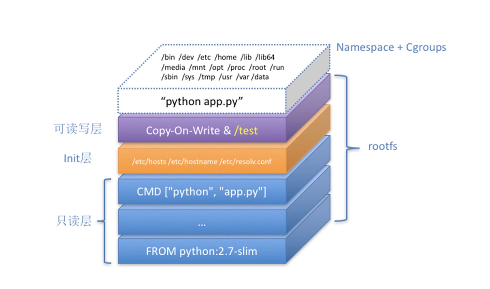
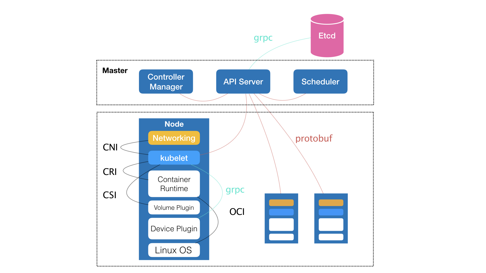
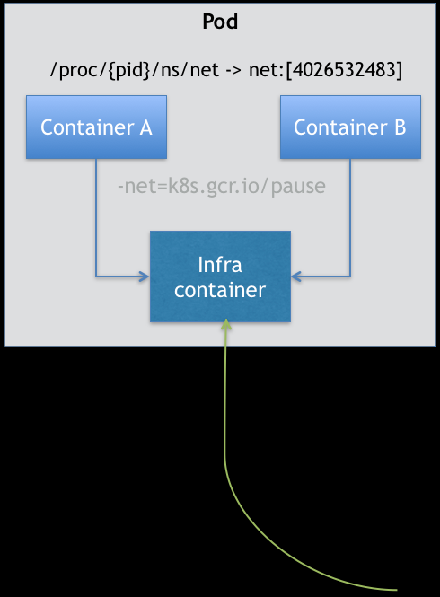
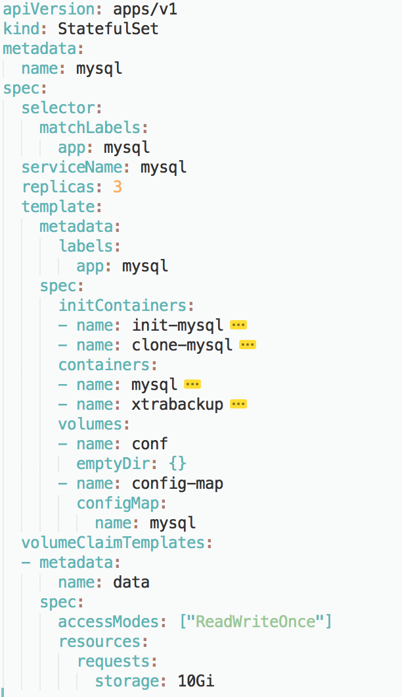
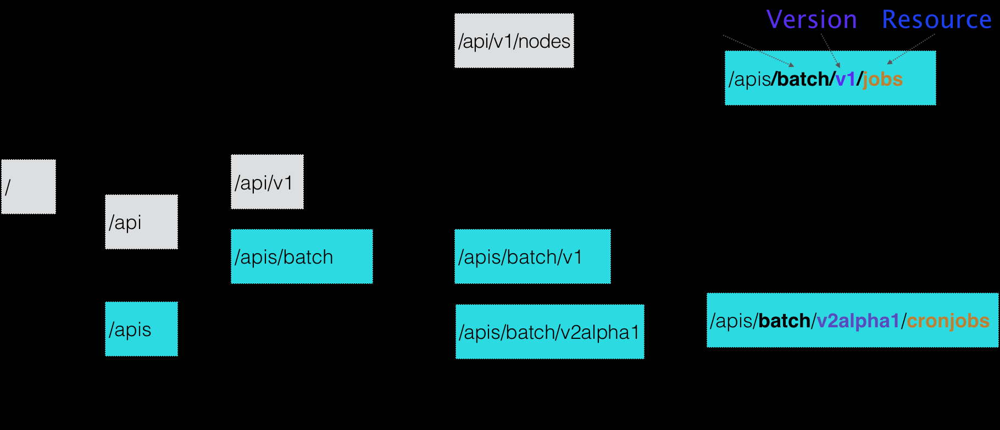
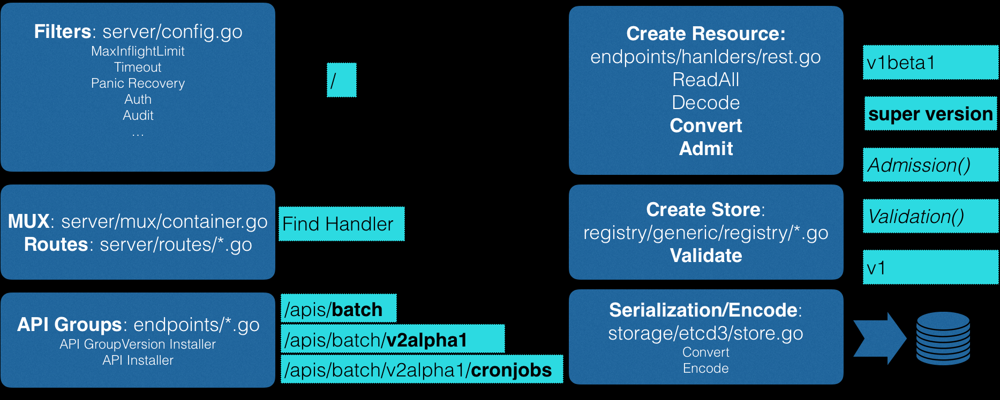

# 深入理解Kubernetes笔记

## 容器基础:从进程开始

> 容器的核心功能：通过约束和修改进程的动态表现，为其创造出一个"边界"。

### 1. 实现容器边界

Docker等大多数Linux容器主要使用Linux内核技术来实现隔离和限制：

1. Cgroups(Control Groups)：主要用来制造约束(限制资源)。
2. Namesace(命名空间)：主要用来修改进程视图(制造隔离的"障眼法")。

Namespace机制详解：

- 工作原理：Namespace机制是Linux 创建进程时的一个可选参数(通过clone()系统调用指定CLONE_NEW...参数)。
- "障眼法"：它为被隔离的应用进程创建了一个全新的进程空间视图，使得该进程误以为自己是该空间中PID=1的进程，从而看不到宿主机上的真实进程空间和其他Namespace里的情况。
- 真实情况：在宿主机真实的进程空间里，这个进程依然是它本来的真实PID。
- 核心结论：容器，其实是一种特殊的进程而已。Docker只是在创建应用进程时，为它们加上了各种Namespace参数。

  Linux提供的Namespace类型：
  
  - PID Namespace：隔离进程编号。
  - Mount Namespace：隔离挂载点信息(文件系统)。
  - Network Namespace：隔离网络设备和配置。
  - IPC Namespace：隔离进程间通信。
  - User Namespace：隔离用户和用户组ID。
  - Cgroups Namespace：隔离Cgroups视图(较新)。

## 2. 容器与虚拟机的对比：

- 虚拟机(VM)工作原理：
  * Hypervisor软件通过硬件虚拟化，模拟出CPU、内存、I/O设备等硬件。
  * 在这些虚拟硬件之上安装Guest OS(客户操作系统)。
  * 应用运行在Guest OS中，拥有自己的文件系统和设备。
- 容器(Container)工作原理：
  * 没有真正的"容器"运行在宿主机里。
  * Docker启动的仍是原来的应用进程。
  * 通过Namespace为这些进程设置隔离视图，使它们"以为"自己运行在独立环境中。
  * 所有容器共享宿主机的Linux内核。

---

## 隔离与限制(Cgroups)

### 1. 容器与虚拟机的架构对比与优势

- 架构定位的修正：Docker Engine(或任何容器管理工具)不应与Hypervisor放在同等位置。容器里的应用进程与宿主机上的其他进程一样，都由宿主机操作系统统一管理，只是拥有额外的Namespace参数设置。Docker扮演的是旁路的辅助和管理角色。

- 容器相对优势：
  * 高性能：由于容器是宿主机上的普通进程，消除了Hypervisor拦截和处理带来的虚拟化性能损耗(尤其在计算、网络、磁盘I/O方面)。
  * 敏捷性(轻量级)：无需运行完整的Guest OS，容器的额外资源占用几乎可以忽略不计(VM启动需要占用100-200MB内存)。

---

### 2. Linux Namespace隔离的不足之处(劣势)

虽然Namespace提供了隔离，但相比于虚拟机，其隔离性存在不足：

1. 内核共享
2. 隔离不彻底
3. 安全攻击面大

---

### 3. 容器的资源"限制"即使：Cgroups

- 限制的必要性：尽管有了Namespace隔离，但容器进程在宿主机上与其他进程仍然是平等的竞争关系。如果不加限制，一个容器进程可能会占用所有资源，影响其他进程(包括其他容器)。
- 技术名称：Linux Cgroups(Control Group)。
- 核心作用：限制一个进程组能够使用的资源上限，包括CPU、内存、磁盘I/O、网络带宽等。

Cgroups的工作原理与实践

1. 文件系统接口：Cgroups通过文件目录的方式组织在操作系统的/sys/fs/cgroup路径下。
2. 子系统(Subsystem)：/sys/fs/cgroup下的子目录(如cpu、memory、blkio等)代表了可以被限制的资源种类。
3. 控制组(Control Group)：在子系统目录下创建一个目录(例如mkdir container)，这个新目录就是一个"控制组"。系统会自动生成该子系统对应的资源限制文件。
4. 设置限制：通过修改控制组目录下的资源限制文件来设置资源上限：
  a. 例如，在/sys/fs/cgroup/container 中设置cpu.cfs_quata_us和cpu.cfs_period_us，可以限制CPU使用比例。
5. 进程归属：将被限制的进程PID写入控制目录下的tasks文件，限制即生效。

---

### 4. 容器中的重要概念与遗留问题

- 容器的本质：一个正在运行的Docker容器，就是一个启用了多个Linux Namespace的应用进程，而这个进程能使用的资源量则受Cgroups配置的限制。
- 容器的"但进程"模型：容器本质上是一个进程，用户的应用进程通常就是容器里PID=1的进程：
  * 设计期望：容器和应用能够同生命周期。
  * 问题：容器内不适合同时运行两个不相关的应用，如果需要运行多个应用，需要使用systemd/supervisord等作为PID=1的父进程(但更推荐使用容器设计模式)。
- Cgroups的不完善：/proc文件系统问题：
  * 问题现象：在容器执行top命令查看的其实是/proc目录下的文件，所以显示的是宿主机的CPU和内存数据，而不是当前容器的限制数据。
  * 原因：/proc文件系统不了解Cgroups限制的存在。
  * 解决方案：lxcfs等工具通过FUSE文件系统模拟出正确的/proc信息，供容器内应用读取。

## 深入理解容器镜像与rootfs

### 1. 容器文件系统的真相
- Mount Namespace的误区：仅仅开启Mount Namespace，容器进程看到的文件系统依然是宿主机的。因为容器继承了宿主机的挂载点。
- 改变视图的关键：必须在Namespace创建后，执行挂载操作(mount):
  * Mount：挂载指定目录(如/tmp挂载为tmpfs)。
  * Chroot(Change Root)：将进程的根目录/切换到指定路径。这是容器文件系统的基石。
  * Switching：Docker实际优先使用pivot_root系统调用，不支持时才回退到chroot。

---

### 2. Rootfs(根文件系统)
- 定义：一个包含了操作系统所有文件、配置和目录(如/bin,/etc,/proc)的文件包。
- 躯壳与灵魂：
  * 躯壳(rootfs)：提供应用运行的用户环境(User Space)。
  * 灵魂(Kernel)：容器共享宿主机的操作系统内核。
  * 专家注：这也是容器比虚拟机轻量(因为没有Guest OS内核)，但也比虚拟机隔离性差(共享进内核)的根本原因。
- 价值：一致性。rootfs将应用及其依赖(操作系统级别的依赖)打包在一起，解决了"在我的机器上能跑，在服务器上跑不了"的经典问题。

---

### 3. 联合文件系统(UnionFS)与分层镜像
为了解决rootfs重复制作和更新带来的碎片化问题，Docker引入了Layer(层)的概念。

- 技术原理：UnionFS(如AuFS，OverlayFS)可以将不同位置的目录联合挂在到一个统一的目录下。
- 镜像三层结构：
  * 只读层(Read-Only Layer)：位于最底层，包含基础镜像(如Ubuntu，CentOS)的文件。可能有多个只读层叠加。
  * init层(Internal Layer)：位于中间，Docker自动生成。存放/etc/hosts，/etc/recolv.conf等与当前环境相关的配置。commit时会被忽略。
  * 可读写层(Read-Write Layer)：位于最顶层(容器层)。所有对容器的增删改操作都发生在这里。

---

### 4. Copy-on-Write(CoW)与Whiteout
- 修改文件：当要修改只读层的文件时，系统会将该文件复制到可读写层，然后进行修改(Copy-on-Write)。容器进程只看到最上层的文件。
- 删除文件：当要删除只读层文件时，系统会在可读写层创建一个特殊的Whiteout文件(.wh.foo)。这会"遮挡"住洗面的文件，实现逻辑删除。

## 镜像文件的演进

### 1. 存储驱动的改朝换代：AuFS已成为历史
- 上文是一AuFS为例进行介绍的。
- 现状：AuFS因为未能进入Linux主线内核且性能问题，已经被Overlay2全面取代。
- OverlayFS(Overlsy2)：
  * 架构更简单：只有LowerDir(只读)，UpperDir(读写)，MergedDir(挂载点)，WorkDir(中间处理)。
  * 性能更优：Page Cache共享更好，inode消耗更少。
  * 建议：在生产环境中，现在默认且强烈使用Overlay2。

---

### 2. 镜像分发的革命：按需加载(lazy Loading)
- 痛点：传统镜像(OCI v1)必须下载完成所有层才能启动容器。随着AI模型和复杂应用导致镜像越拉越大(GB级别)，启动速度变慢。
- 新技术：
  * eStargz(Google)：重组镜像内的文件布局，使得容器运行时可以只拉取需要的文件快，无需下载整个镜像。
  * Nydus(Dragonfly/Alibaba)：一种优化的容器文件系统。它将元数据和数据分离，支持"秒级启动"，并利用P2P技术加速分发。
- 趋势：从"全量下载"转向"按需流式加载"。

---

### 3. 隔离技术的反击：沙箱容器(Sandboxed Containers)
- 课程观点：容器共享内核，隔离性不如虚拟机。
- 最新进展：为了解决共享内核的安全风险，出现了基于轻量级虚拟化的容器运行时：
  * kata container：每个Pod运行在一个独立的轻量虚拟机(Micro VM)中，拥有独立的内核。
  * gVisor(Google)：在用户态模拟了一个内核层，拦截并处理系统调用，不直接让容器接触宿主机内核。
- 适用场景：多租户环境、Serverless平台、高安全敏感业务。

---

### 4. 构建工具的进化：脱离Docker Daemon
- 过去：docker build 强依赖Docker Daemon。
- 线下：Kubernetes集群中(特别是CI/CD流水线)，我们倾向于使用无守护进程(Daemonless)的构建工具：
  * Kaniko：谷歌开源，可以在K8s Pod中构建镜像并推送到仓库，无需特权模式。(目前已归档)。
  * BuildKit：Docker的下一代构建引擎，支持并行构建、缓存优化，速度极快。

## 重新认识Docker容器

### 1. 容器构建与镜像制作(Dockerfile)
Dockerfile是制作容器镜像的**声明式** 方式，它将复杂的rootfs制作过程标准化。

| 原语 | 作用 | 原理关联 | 关键点 |
| --------------- | --------------- | --------------- | --------------- |
| FROM | 指定基础镜像 | 基于现有rootfs | 避免重复安装环境(如python2.7-slim) |
| RUN | 在容器内部执行shell命令 | CoW（写时复制） | 没孩子行一个RUN都会生成一个新的镜像层。 |
| ADD/COPY | 将宿主机文件复制到容器内 | rootfs增量 | 复制操作也创建新的镜像层 |
| ENV/EXPOSE | 设置环境变量、暴露端口 | 写入镜像层元数据。 | 即使没有修改文件，也会生成一个空层。 |
| CMD/ENTRYPOINT |  定义容器启动时执行的命令 | 容器进程的PID 1 | 完整格式是 ENTRYPOINT CMD；默认隐含 ENTRYPOINT为/bin/sh -c|

  精髓：docker build 的过程等同于：启动一个基础镜像容器 -> 依次执行Dockerfile总的原语 -> 每一步操作的结果都保存为一个增量只读镜像层。



---

### 2. Docker容器的本质与隔离机制
容器本质是运行在宿主机上的一个进程，该进程通过Linux内核技术被赋予了"隔离"和"限制"的能力

#### 1. docker exec 的实现原理
docker exec允许你进入一个正在运行的容器，其核心是利用Linux Namespace的文件表示和setns()系统调用。

- Namespac文件：每个运行中的进程(包括容器进程)的各种Namespace信息，都以虚拟文件的形式存在于宿主机上：/proc/[PID]/ns/目录下。
- setns()系统调用：docker exec启动一个新的进程(例如 /bin/bash)，然后通过setns()系统调用，将这个新进程加入到目标容器进程(PID 1)已有的Namespace中：
  * 例如，加入容器的Network Namespace后，新进程就只能看到容器内部的网络设备和配置。
- 共享Namespace：一个进程一旦加入，它与目标容器进程就会共享Namespace(例如 /proc/[PID]/ns/net文件会指向同一个net:[inode号])。
- 特殊用法：docker run -net container:`<ID>`可以让一个新容器直接共享量一个容器的Network Namespace，常用于Pod(Kubernetes)模型的网络实现。

#### 2. 容器生命周期中的PID 1
- dockerinit(初始化进程)：Docker并非直接运行应用进程。它首先会创建一个dockerinit进程。
- 职责：dockerinit负责在容器内部完成所有初始化操作，包括：
  * 准备rootfs(联合挂载)。
  * 配置hostname和挂载设备。
  * 执行完初始化后，dockerinit会通过execv()系统调用，用应用进程(ENTRYPOINT + CMD)取代自己。
- 结果：应用进程取代了dockerinit，因此它成为了容器内唯一且真正的PID 1进程。

---

### 3. 数据卷Volume的核心原理
Volume机制用于解决容器内部文件与宿主机之间的**持久化**和**共享**的问题。

#### 1. Volume挂载的本质
Volume 机制的关键在于利用了绑定挂载(Bind Mount)机制，并且执行时机非常巧妙。

- 挂载时机：在容器的Mount Namespace已经开启，但容器进程**尚未执行chroot(或pivot_root)** 切换根目录之前。
- 核心操作：在宿主机空间内，将Volume指定宿主机目录(如/home)通过绑定挂载，挂载到容器rootfs可读写层上的对应目录(如/var/lib/docker/overlay2/[id]/diff/test)上。

#### 2. 绑定挂载(Bind Mount)机制
- 作用：允许将一个目录或文件挂载到另一个指定的目录上，实现内容替换。
- Linux原理：绑定挂载相当于inode替换。当修改挂载点(如容器内的/test目录)时，实际修改的是被挂载目录(宿主机上的/home)的inode。
- 隔离性：由于这个挂载操作发生在容器的Mount Namesspace内，因此宿主机无法感知这次挂载。这保证了容器的隔离性。

#### 3. Volume不会被提交
- docker commit机制：有docker commit发生在宿主机空间，且宿主机看不到容器内部的绑定挂载。
- 结果：在宿主机看来，可读写层(UpperDir)上Volume挂载点(如/test)始终是空的，因此Volume里的实际数据不会被提交到新的镜像中。

## Kubernetes本质
### 1. 容器基础再认识
- 容器 = 隔离环境 + 镜像:
  * 静态部分：容器镜像(rootfs联合挂载) -> 开发者真正关系的载体
  * 动态部分：容器运行时(Namespace + Cgroups) -> 底层实现细节
- 关键洞察：在"开发-测试-发布"流程中，传递的是镜像而非运行时

---


### 2. 从容器到容器云的飞跃
- 容器云价值链条
 ```shell
 开发者 -> 镜像 -> 云平台 -> 生态服务(CI/CD/监控/安全等)
```
- 核心逻辑：云厂商通过镜像直接连接开发者，沉淀整个技术栈价值

---


### 3. Kubernetes架构精要

控制平面(Master节点)

| 组件 | 职责 | 要点 |
| --------------- | --------------- | --------------- |
| kube-apiserver | API入口，数据验证 | 集群总工 |
| kube-scheduler | Pod调度决策 | 工作分配员 |
| kube-controller-manager | 集群状态调节 | 系统管家 |
| etcd | 持久化存储 | 集群大脑记忆 |


工作节点(Node节点)
| 组件 | 职责 | 交互接口 |
| --------------- | --------------- | --------------- |
| kubelet | 节点核心代理 | 与Master通信 |
| 容器运行时 | 运行容器 | CRI接口 |
| 网络插件 | 配置网络 | CNI接口 |
| 存储插件 | 配置存储 | CSI接口 |
| Device Plugin | 管理特殊硬件 | gRPC协议 |




--- 

### 4. 核心设计理念：处理关系的艺术

1. 关系抽象(源自Borg经验):
  - 核心观点：“大规模集群中任务建关系处理才是最难的”
  - 关系类型处理：
    - 紧密协作 -> Pod(共享Network Namespace + Volume)
    - j服务访问 -> Service(固定IP/域名，解耦动态Pod)
    - 安全凭证 -> Secret(自动挂载敏感数据)
    - 特殊形态 -> 专用控制器：
      * Deployment：无状态应用
      * StatfulSet：有状态应用
      * DaemonSet：守护进程
      * Job/CronJob：一次性/定时任务

1. 声明式API
- 核心模式：
  * 编排对象(Pod/Deployment/StatefulSet等)：描述应用是什么
  * 服务对象(Service/Secret/HPA等)：描述应用如何工作
- 使用方式：编写YAML声明期望状态 -> 系统自动达成

---

### 5. Kubernetes本质 vs. 竞品

| 维度 | Kubernetes | Docker Swarm |
| --------------- | --------------- | --------------- |
| 核心能力 | 容器关系编排 | 容器调度 |
| 设计思想 | 抽象普适，为未来扩展预留 | 问题驱动，针对性解决 |
| API风格 | 声明式(Declarative) | 命令式(Imperative) |
| 状态管理 | 声明期望状态，自动调节 | 执行具体命令 |
| 源头灵感 | Google Borg论文(生产验证) | 新设计 |

## 为什么需要Pod

### 1. Pod的本质定位
- 核心定义：Pod是Kubernetes中最小的API对象和原子调度单位
- 哲学视角：
  * 容器 = 云计算系统的进程
  * Kubernetes = 云计算的操作系统
  * Pod = 操作系统中的进程组
- Pod是逻辑概念，不是实际的隔离环境，它是一组共享资源的容器集合。

---

### 2. 为什么需要Pod？解决的核心问题
1. 进程组写作需求：
  a. 现实场景：操作系统中进程通常以"组"方式协作(如rsyslog由多个子进程组成)
  b. 容器困境：容器"单进程模型"限制(容器没有管理多个进程的能力，PID=1进程就是应用本身)
  c. 调度难题：传统调度器无法处理"成组调度(gang sheduling)"问题
```shell
示例：三个相关容器需要3GB内存
问题：若前两个容器占用了node-2的2.5GB，第三个容器无法调度。
Pod方案：按整个Pod资源需求一次性调度，避免资源碎片
```
2. “超亲密关系”处理：
  a. 定义：容器间存在以下一种或多种紧密关系：
    i. 频繁本地通信
    ii. 直接文件交换
    iii. 非常频繁的远程调用
    iv.  共享Linux Namespace
  b. 重要区分：不是所有关系的容器都应在同一Pod:
    i. 同Pod：紧密协作、必须同机部署的组件
    ii. 不同Pod：如PHP应用与Mysql，适合松耦合部署

---

### 3. Pod的实现原理
- 核心机制：Infra容器:
  * 角色：Pod中的"奠基者"，永远第一个创建
  * 实现：使用特殊镜像`k8s.gcr.io/pause`(仅100-200KB,汇编编写，永远暂停状态)
  * 功能：
    + "Hold"Network Namespace
    + 为其他容器提供共享网络基础
    + 定义Pod生命周期(Pod生命周期只与Infra容器一致)


- 资源共享机制
  | 共享资源 | 实现方式 | 效果 |
  | --------------- | --------------- | --------------- |
  | Network Namespace | 其他容器Join Infra容器网络 | 所有容器共享同一IP |
  | Volume | 在Pod层级定义Volume，容器声明挂载 | 多容器共享同一volume |
  
- 网络特性：
  * 一个Pod只有一个IP地址
  * 所有网络资源(端口、路由表)Pod内共享
  * 网络插件只需要配置Pod(Infra容器)的Network Namespace，无需关注单个容器

---

### 4. 容器设计模式：Sidecar模式

- 模式定义：
  * 核心思想：在Pod中启动一个辅助容器(sidecar)，完成独立于主进程之外的工作
  * 优势：解耦功能、提高复用性、简化容器设计

- 典型场景：
  * 场景1：WAR包与WEB服务器
  * 工作流程：Init Container复制WAR包 → 共享Volume → Tomcat容器读取并部署
  - 优势：解耦应用与运行时，独立更新WAR包或Tomcat

```yaml
apiVersion: v1
kind: Pod
metadata:
  name: javaweb-2
spec:
  initContainers:  # 优先执行的辅助容器
  - image: geektime/sample:v2
    name: war
    command: ["cp", "/sample.war", "/app"]
    volumeMounts:
    - mountPath: /app
      name: app-volume
  containers:
  - image: geektime/tomcat:7.0
    name: tomcat
    volumeMounts:
    - mountPath: /root/apache-tomcat-7.0.42-v2/webapps
      name: app-volume
  volumes:
  - name: app-volume
    emptyDir: {}  # 临时共享存储
```
- 场景2：日志收集：
  - 架构：
    - 主容器：将日志写入共享Volume
    - Sidecar容器：从共享Volume读取日志，转发到日志系统
  - 优势：日志收集逻辑与应用逻辑分离，无需修改主应用

---

### 5. 核心洞见与设计哲学

1. Pod vs 虚拟机
  - 新视角：Pod扮演传统"虚拟机"角色，容器是虚拟机中运行的程序
  - 迁移指导：将虚拟机中运行的多个进程，转化为Pod中的多个容器：
    - 有启动顺序的 → Init Container
    - 并行运行的 → 普通容器
    - 共享资源的 → 通过Volume共享

2. 容器本质认知
  - 关键原则：一个容器 = 一个进程（严格说是缺乏进程管理能力的单进程模型）
  - 反模式警告：
    - 避免在单容器中运行多进程
    - 避免"Docker in Docker"等复杂嵌套方案
    - 不要将容器视为"轻量级虚拟机"

3. 架构演进
  - 从单体到微服务：Pod提供自然过渡路径
  - 最佳实践：松耦合设计，每个容器专注单一职责

## Pod的基本概念

### 1. Kubernetes的关键理念与核心抽象

#### 1.1 Pod是最小编排单位
- Kubernetes的核心设计：Pod，而非容器，是调度、网络、存储和安全策略管理的对象。
- Pod在语义上接近"轻量虚拟机"：
  * 容器在Pod内共享环境(特别是Linux Namespace与资源视图)。
  * Pod承担"机器角色"，容器是"程序"。

#### 1.2 Pod与Container的关系
- container是Pod.spec中的普通字段。
- Pod管的是整体(网络、存储、调度、安全)，Container管运行逻辑(镜像、命令、挂载)。

---

### 2. Pod的关键字段与语义

#### 2.1 调度相关字段(Pod 级别)

| 字段 | 作用 |
| -------------- | --------------- |
| nodeSelect | 指定Pod必须调度到具备特定label的节点。 |
| nodeName | 指定目标节点(跳过调度器)，常用于调试。 |
| affinity/anti-affinity | 更细粒度的调度约束。 |

#### 2.2 网络/存储/安全(Pod级别)
- Pod整体的“机身配置”:
  * hostNetwork/hostPID/hostIPC：共享宿主机Namespace。
  * volumes：定义存储卷。
  * securityContext(Pod级别)：定义整体安全策略。

#### 2.3 /etc/hosts控制(Pod级别)
- hostAliases:
  * 以声明方式修改hosts文件。
  * Pod重建后由Kubelet重写；不可直接手动修改。

---

### 3. Pod内多容器协作机制

#### 3.1 Linux Namespace 共享
- Pod设计核心目标：让同一个Pod内的容器尽可能共享Namespace，类似进程在同一台机器上运行。
- 常见共享模式：
  * shareProcessNamespace: true -> 容器共享PID Namespace，可互相看到对方进程(含pause容器)。
  * hostNetwork/HostPID/hostIPC -> 直接使用宿主机的Namespace

#### 3.2 Init Container

- 与普通容器等价定义，但执行顺序严格控制：
  * 顺序必定为initContainer1 -> 2 -> ... -> containers。
  * 用于依赖准备、环境检查等场景。

--- 

### 4. Container(容器)级别的关键字
- ImgagePullPolicy:
  * 如果镜像标签是latest或者没有指定tag，则默认ImagePullPolicy=Always。-- 总是拉去像，至于底层CRI是否会根据layer进行hash的判断，这里不谈。
  * 如果镜像标签是其他具体标签(如nginx:1.21)
  * IfNotPresent:宿主机没有才拉取(推荐生产环境配合使用具体版本号并配合此项)。
  * Never：只使用本地镜像。
- Lifecycle(生命周期钩子)：
  * postStart：容器启动后立即执行。注意：它与ENTRYPOINT异步执行，不保证先后顺序。
  * preStop：容器被杀死前执行。它是同步阻塞的，常用于应用的"优雅退出"(如关闭数据库连接)。

---

### 4. Pod的生命周期与状态机
Pod的status.phase是判断应用健康状况的第一窗口：

1. Pending：资源请求已提交，但尚未调度成功或镜像正在下载。
2. Running：至少一个容器正在运行。
3. Succeeded：所有容器正常退出(状态码0)，多见于Job任务。
4. Failed：至少一个容器非正常退出。
5. Unknown：Kubelet失去联系(通常是网络插件或节点宕机问题)。
注：Running不等于Ready：Running仅代表进程在运行，而Ready(属于Conditions)才代表Pod已经通过了健康检查，可以对外接收流量。

## 深入解析Pod对象(二)使用进阶
### 1. 投射数据卷(Projected Volume)
Projected Volume是k8s v1.11+的重要特性。它的本质是：将集群内的元数据或配置信息，像"投影"一样映射到Pod内部的卷中。
| 类型 | 核心作用 | 技术要点 |
| --------------- | --------------- | --------------- |
| Secret | 存放敏感数据(如数据库密码、Token) | 数据在Etcd中以Base64编码存储(非加密，需开启加密插件) |
| ConfigMap | 存放非敏感数据(如.yaml文件) | 支持文件热更新，容器内文件随Etcd数据更新而自动变化 |
| Downward API | 让容器获取Pod自身的元数据 | 可获取Pod IP、Node Name、Labels、CPU/MEM限制等 |
| ServiceAccountToken | 存放API Server的访问凭证 | 默认自动挂载在`/var/run/secrets/Kubernetes.io/serviceaccount` |

注：获取配置建议优先使用Volume挂载而非环境变量。环境变量不支持热更新，而Volume挂载文件由kubelet维护，具备自动更新能力。

---

### 2. 容器健康检查：Probe(探针)机制
这是生产环境"自愈能力"的核心。

- livenessProbe(存活探针):
  * 作用：判断容器是否还在"活着"。
  * 失败后果：Kubelet会杀掉该容器，并根据restartPolicy进程重启(重建)。
- readinessProbe(就绪探针):
  * 作用: 判断容器是否"准备好接收流量"。
  * 失败后果：Pod会从Service的Endpoints中剔除，流量不再切入，但不会重启容器。

探测方式对比：

1. ExecAction：在容器内执行命令(看退出码是否为0)。
2. HTTPGetAction：发起HTTP GET请求(看状态码是否在200-400之间)。
3. TCPSocketAction：检查端口是否可以建立TCP连接。

---

### 3. Pod恢复策略：restartPolicy
重启永远发生在当前节点，Pod不会因为容器失败而自动漂移到其他Node。

- Always(默认)：只要退出就重启。
- OnFailure：只有非正常退出(退出码非0)才重启。
- Never：从不重启。适用于需要保留退出后现场(日志、文件)进行Debug的场景。

---

### 4. 自动化利器：PodPreset(Pod预设置)
解决痛点：运维人员希望统一给Pod注入环境变量、挂载存储，而不需要开发人员在每个YAML里重复编写。

- 工作原理：通过selector匹配带有特定Label的Pod。
- 合并规则：Pod创建时，API Server自动将PodPreset定义的内容合并到Pod对象中。
- 冲突处理：如果PodPreset注入的字段与Pod原始字段冲突，则冲突部分不予修改。

---

### 5. In-Cluster编程
ServiceAccount是K8s内部服务的身份卡。

- 如果你想在Pod里写代码调用K8s API，无需手动配置Token。
- 直接使用官方Client库，它会自动识别挂载到`var/run/secrets/...`下的Token，这被称为InClusterConfig模式。

## 编排的本质 -- 控制器模式
### 1. 核心哲学：控制循环(Control Loop)
Kubernetes的编排并不神秘，其核心是一个不断运行的死循环。它通过不断地将"实现"与"理想"对比，来驱动系统状态的改变。

- 实际状态(Actual State)：由集群本身汇报(如Kubelet汇报的容器状态)。
- 期望状态(Desired State)：由用户通过YAML声明(如Deployment中的replicas:3)。
- 协调(Reconcile)：对比两者的差异，并执行写操作(创建或删除Pod)使其趋于一致。

伪代码描述逻辑：
```go
for {
  实际状态 := 获取集群中对象X的实际状态
  期望状态 := 获取集群中对象X的期望状态
  if 实际状态 == 期望状态 {
    continue // 休息一会儿
  } else {
    执行编排动作，将实际状态调整为期望状态
  }
}
```
---

### 2. 控制器的组成结构
一个标准的控制器对象(如Deployment)通常由两部分组成：

1. 控制器定义：包含期望状态(如副本数、标签选择器selector等)。
2. 被控制对象的模版(PotTemplate)：定义了要生成的Pod应该长什么样(镜像、端口、挂载等)。

---

### 3. kube-controller-manager：控制器的集合
在k8s架构中，由一个专门的组件叫kube-controller-manager。它并不是一个单一的控制器，而是一系列控制器的合集。

- 每一个控制器负责一种资源：DeploymentController、JobController、StatefulSetController等。
- 它们都在同一个进程中运行，各自执行自己的控制循环。

--- 

### 4. 面向API对象编程
在控制器模式下，我们对集群的操作不再是"命令式"的(例如：运行一个容器)，而是"声明式"的(例如：我想要3个这样的容器)。

- OwnerReference：每个被创建出来的Pod都会有一个ownerReference字段，指向它的"拥有者"(如 ReplicaSet)，这保证了对象之间的从属关系。

---

### 5. 控制器模式 vs 事件驱动
| 维度 | 事件驱动(Event-Driven) | 控制器模式(Controller Pattern) |
| --------------- | --------------- | --------------- |
| 触发机制 | 某个事件发生时触发动作 | 定期循环检查(边缘触发+水平触发) |
| 可靠性 | 如果事件丢失或处理失败，可能导致状态不一致 | 只要循环在，即使错过某次事件，下次循环依然能修复状态 |
| 状态维护 | 关注"过程"和"变化" | 关注"结果"和"最终一致性" |


- 所有控制器共用一个逻辑：无论是简单的Deployment还是复杂的StatefulSet，核心都是Reconcile Loop。
- Informer机制：虽然逻辑上是循环，但为了性能，k8s内部使用Informer机制来实现"及时通知"，避免频繁空转。

## Deployment与水平扩展/滚动更新
### 1. 核心层级架构
Deployment是一个两层控制器，其层级关系如下：

- 第一层：Deployment控制ReplicaSet(版本管理)。
- 第二层：ReplicaSet控制Pod(副本数管理)。
注：这种设计实现了"应用版本"与"ReplicaSet"的一一对应。每一个新的ReplicaSet都代表应用的一个新版本。

---

### 2. 水平扩展/缩容(Scaling)
- 原理：Deployment Controller只需要修改它所控制的ReplcaSet的replicas字段。
- 指令：`kubectl scale deployment nginx-deployment --replias=4`

---

### 3. 滚动更新(Rolling Update)
这是Deployment最强大的编排能力，允许在不中断服务的情况下升级。

- 执行过程：
  * 创建一个新版本的ReplicaSet。
  * 新RS"水平扩展"出一个Pod。
  * 旧RS"水平收缩"掉一个Pod。
  * 交替进行，知道旧RS副本数为0，新RS达到DESIRED数量。
- 状态字段解读：
  * DESIRED：期望副本数。
  * UP-TO-DATE：已升级到最新的Pod数。
  * AVAILABLE：用户真正可用的Pod数(Running + 最新版 + Ready健康检查通过)。

---

### 4. 版本控制与回滚(Rollback)
依靠保留旧版本的ReplicaSet，Deployment可以轻松实现"一键回滚"。

- 查看历史：`kubectl rollout history deployment/nginx-deployment `
- 回滚至上一个版本：`kubectl rollout undo deployment/nginx-deployment`
- 回滚至指定版本：`kubectl rollout undo ... --to-revision=2`
- 控制历史版本数量：设置spec.revisionHistoryLimit(若为0则无法回滚)

---

### 5. 滚动更新策略控制
通过RollingUpdateStrategy确保服务连续性：

- maxSurge：升级过程中，最多比DESIRED数量多出多少个Pod。
- maxUnavailable：升级过程中，最多有多少个Pod处于不可用状态。

---

### 6. 建议
如果你需要对 Deployment 进行多次修改（如改镜像、改配置、改 Labels），为了避免每改一次都触发一次滚动更新，可以使用以下技巧：

- 暂停：kubectl rollout pause（进入暂停状态，修改不会触发更新）。
- 修改：执行多次 kubectl set image 或 kubectl edit。
- 恢复：kubectl rollout resume（所有修改合并为一次滚动更新）。

## 深入理解StatefulSet之拓扑状态
### 1. 为什么需要StatefulSet？
- Deployment的局限性：假设所有Pod完全对等、无序、可随时替换(无状态)。
- 有状态应用(Stateful Application)的特征：
  * 拓扑状态：实例间不对等关系(如主从、主备)或严格的启动/顺序要求。
  * 存储状态：实例与外部持久化数据由绑定关系，重建后需找回"旧数据"。

---

### 2. 核心机制：Headless Service(无头服务)
StatefulSet实现"拓扑状态"稳定的关键工具。

- 定义方式：在Service的YAML中设置`cluster: None`。
- 特点：
  * 没有VIP：不分配虚拟IP，不进行负载均衡。
  * DNS解析：直接将Service的DNS记录解析为代理的所有Pod的IP地址列表。
- 网络身份公式：`<pod-name>.<svc-name>.<namespace>.svc.cluster.local`
核心价值：为每一个Pod提供一个在集群内永久不变、可解析的"网络标识"。

---

### 3. StatefulSet的"拓扑状态"保证
Kubernetes通过以下两个手段确保有状态应用的稳定性:

- 唯一编号(Ordinal Index)：
  * Pod命名规则：`<statefulset-name>-<index>`(如`web-0`,`web-1`)。
  * 有序启动：Pod按照0到N-1的顺序逐一创建。前一个Ready后，后一个才开始创建。
  * 有序删除：删除时按逆序(N-1到0)进行。
- 稳定的网络标识：
  * 即使Pod被删除并重建，其Name和Hostname保持不变(依然是`web-0`)。
  * 对应的DNS记录(如web-0.nginx)会自动更新到新Pod的IP。
  * 结论：访问者应通过DNS域名访问特定节点，而非IP。

---

### 4. 关键总结
- StatefulSet = 有序编号 + 稳定的DNS标识。
- 它不保证Pod IP不变，但保证你通过同一个"名字"总能找到对应编号的实例。
- 它是对Deployment的改良，专门处理那些"离了谁都不行"或者"必须按顺序来"的分布式业务。

## 深入理解StatefulSet之存储状态
### 1. PV与PVC：存储的"接口"与"实现"
为了解决开发者不懂底层存储架构、运维不希望暴露基础设施细节的问题，Kubernetes引入了：

- PVC(Persistent Volume Claim)：接口/需求。开发者生命"我需要1GBi的可读写存储"，而不必关心底层是Ceph还是阿里云盘。
- PV(Persistent Volume)：实现/资源。运维人员预先创建好的、对应真实存储资产的对象。
- 核心逻辑：PVC与符合条件的PV自动绑定，Pod通过引用PVC来使用存储。

---

### 2. StatefulSet的核心武器：`volumeClaimTemplates`
这是StatefulSet与Deployment在存储处理上的本质区别：

- Deployment：所有Pod共享同一个PVC(通常只能用于分布式文件系统如NFS)。
- StatefulSet：使用PVC模板：
  * 自动编号：它会为每一个Pod自动创建一个专属PVC。
  * 命名规则：`<PVC名字>-<StatefulSet名字>-编号`(如`www-web-0`)。
  * 一对一绑定：`web-0`永远只挂载`www-web-0`，`web-1`永远只挂载`www-web-1`。

---

### 3. 存储状态的"持久化"原理(关键流程)
StatefulSet如何保证Pod重建后数据不丢？

1. 数据写入：Pod web-0运行，数据写入其挂载的PV中(数据实际存在远程存储服务器上)。
2. Pod删除：执行`kubectl delete pod web-0`。此时Pod消失 了，但PVC和PV依然存在。
3. Pod重建：Statefulset控制器发现少了一个web-0，重新创建它。
4. 重新关联：新web-0启动时，声明的需求依然是www-web-0。Kubernetes发现这个PVC已经存在且Bound(绑定)了旧PV，于是直接挂载。
5. 结果：新Pod瞬间找回了旧Pod的数据。

---

### 4. 总结：StatefulSet的"三位一体"
StatefulSet通过整合三项技术实现了有状态应用的编排：

1. 拓扑状态：通过唯一编号确定创建/删除顺序。
2. 网络标识：通过Headless Service配合编号提供唯一的DNS访问入口。
3. 存储状态：通过PVC模板为每个编号的Pod绑定一个独立的、生命周期脱离Pod的持久化存储。

--- 

### 5. 思考题：如果分布式应用(如分布式数据库)能自动同步数据，还有必要让Pod与PV一对一绑定吗？
这取决于数据量和恢复成本：

- 有必要的情况(常见): 如果数据量巨大(TB级)，新Pod启动后从零同步数据会导致巨大的网络带宽开销和漫长的预热期。此时，"数据就位"(保留原PV)能实现秒级恢复。
- 没必要的情况(极少数): 如果数据极小，或者应用本身就设计为"内存型+全量重拉"，那么不绑定PV可以让调度更灵活。
- 结论：在Kubernetes生态中，为了生产环境的稳定性，通常建议保留一对一绑定，因为"拉取现成数据"永远比"网络重传数据"快且稳。

## 深入理解StatefulSet之实践部署Mysql一主多从集群

### 1. 文章核心内容概括
文章的核心是一个实战案例：如何使用Kubernetes的`StatefulSet`控制器，将一个传统的、非云原生的Mysql主从集群成功"搬进"容器世界。

深入剖析了在Kubernetes中处理有状态应用的通用模式，包括：

- 拓扑状态的管理：如何保证Master是0号，Slave是1,2...号。
- 存储状态的管理：如何保证Pod重启后依然能挂载到原有的数据。
- 复杂初始化逻辑的容器化：利用InitContainer和Sidercar处理数据备份与同步。

---

### 2. 为什么选Mysql？为什么要用StatefulSet？
为什么选Mysql举例？

因为Mysql是典型的**非原生分布式系统**。它对主从切换、数据同步、配置差异有严格的要求，比Etcd或Cassandra更难容器化。攻克了Mysql，就意味着掌握了绝大多数复杂有状态应用的方法。

为什么必须用Statefulset而不是Deployment？

- 身份唯一性：Mysql集群需要固定的编号(如mysql-0必须是Master)。
- 持久化绑定：数据库的数据不能因为Pod漂移而丢失，必须实现Pod与物理存储(PV)的"一对一固定绑定"。
- 有序启动与缩容：Slave节点在启动时需要从前一个节点拷贝数据，这要求Pod必须按顺序启动。

---

### 3. 具体实现步骤

Statefulset对象的大致框架：



**第一步：解决配置差异(利用ConfigMap + InitContainer)**

- 问题：Master需要开启二进制日志(log-bin)，Slave需要只读(super-read-only)。
- 解决：
  * 将两份配置文件存在一个ConfigMap中。
  * 增加一个InitContainer(init-mysql),它读取Pod的序号(index):
    + 如果是0号，拷贝Master配置。
    + 如果非0号，拷贝Slave配置。
    + 同时生成唯一的`server-id`写入配置文件。

**第二步：解决数据同步(利用PVC + InitContainer)**

- 问题：新启动的Slave必须先拥有Master基础数据。
- 解决：
  * 使用`volumeClaimTemplates`自动为每个Pod分配独立的存储卷(PVC)。
  * 增加第二个InitContainer(clone-mysql)：
    + 通过`ncat`指令从"前一个Pod"(如mysql-0)跨网络拷贝数据。
    + 使用`xtrabackup`工具进行数据恢复，确保数据一致性。

**解决集群初始化(利用Sidecar容器)**

- 问题：Mysql容器启动后，需要执行`CHANGE MASTER TO`等SQL语句才能建立主从关系。
- 解决：
  * 引入一个Sidecar容器(`xtrabackup`)，它与Mysql容器共享网络和存储。
  * sidercar负责监听Mysql是否启动成功，然后自动执行拼接好的初始化SQL。
  * 常驻职责：它还会开启3307端口，专门负责给后续新加入的Slave节点提供备份数据传输服务。

**最终StatefulSet的yaml文件请参考下面的链接：**
[k8s]: [https://kubernetes.io/zh-cn/docs/tasks/run-application/run-replicated-stateful-application/ "mysql集群yaml"]

**流量调度：Headless Service + 普通Service**

- 写操作：通过`mysql-0.mysql`(Headless Service 提供的固定DNS)直接访问Msater。
- 读操作：通过`mysql-read`(普通Service)实现多个主从节点之间的负载均衡。

---

### 4. 小结

这篇文章揭示了使用`StatefulSet`的三个核心心法：

1. 人格分裂：些YAML时要分情况考虑"我是0号Pod该做什么"和"我是N号Pod该做什么"。
2. 阅后即焚：初始化脚本要具备幂等，执行完成后要清理临时状态文件，防止容器重启后重复初始化导致报错。
3. 容器平等：Pod内的容器是平等的，Sidecar在执行SQL前必须先做健康检查，等待Mysql主进程就绪。

## 深度解析DaemonSet

### 1. 核心定义与特征
DaemonSet的主要作用是在集群中运行"守护进程"Pod。它具备一下三个"唯一性"特征：

- 全覆盖：Pod运行在集群里的每一个Node上。
- 唯一性：每个节点上有且只有一个这样的Pod实例。
- 自维护：新节点加入时自动创建，旧节点删除时自动回收。

---

### 2. 典型应用场景
- 网络插件Agent(如Flannel，Calico)：处理节点容器网络。
- 存储插件Agent(如Ceph，GlusterFS)：挂载远程卷。
- 运维监控/日志(如Fluentd，Promethues Agent)：搜集节点数据。

---

### 3. 工作原理：如何确保"每台都有"？
DaemonSet并不是靠简单的魔法，而是通过控制器模型和调度增强实现的：
| 机制 | 描述 |
| -------------- | --------------- |
| 控制器模型 | 遍历所有Node，检查Pod数量(0则创建，>1则删除，1则正常) |
| nodeAffinity | 自动在Pod对象中加入节点亲和性，将Pod绑定到特定Node |
| Tolerations | 关键点！自动加入容忍度，使其忽略节点的unschedulable污点，甚至能在master节点上运行。 |

注：DaemonSet的Pod往往比集群网络插件还早出现。通过"容忍"`network-uavailable`污点，它们可以在网络还没通的时候就调度成功，从而完成网络插件自身的初始化。

---

### 4. 版本管理与ControllerRevision
不同于Deployment使用ReplicaSet来记录版本，DaemonSet使用了一个通用的API对象：`ControllerRevision`。

- 本质：在Data字段里保存了该版本完整的DaemonSet API对象快照。
- 操作：
  * 查看历史：`kubectl rollout history ds <name>`
  * 版本回滚：`kubectl rollout undo ds <name> --to-revision=1`
- 逻辑：回滚实际上是读取旧的快照，对当前DaemonSet执行一次PATCH操作。

---

### 5. StatefulSet的"灰度发布"
#### StatefulSet的Partition(分区更新):
- 作用：实现金丝雀发布或灰度发布。
- 用法：设置`spec.updateStrategy.rollingUpdate.partition=N`。
- 效果：只有序号>=N的Pod会被更新，序号<N的Pod即使被删除重启，也会保持旧版本。


## 离线业务编排(Job & CronJob)
### 1. 为什么离线业务需要专门的控制器？
- 在线业务(Deployment/StatefulSet)：追求"永不退出"。如果进程结束，控制器会不断重启它。
- 离线业务(Job)：追求"完成任务"。任务结束后，Pod应该进入`Completed`状态，而不是被重启。

---

### 2. Job：一次性任务的管理者
Job负责创建一个或多个Pod，并确保指定数量的Pod成功终止。

- 核心字段解析：
  * `restartPolicy`：只能设为`Never`(失败则创建新Pod)或`OnFailure`(失败则重启容器)。绝不能设为Always。
  * `backoffLimit`：最大重试次数(默认6)。
  * `activeDeadlineSeconds`：最长运行时间，超时会终止所有相关Pod。
- Label机制：Job会自动生成一个带有`controller-uid`的随机Label，防止不同Job之间的Pod相互干扰。

---

### 3. 并行控制：离线计算的核心
Job通过两个关键参数控制并行计算：
| 参数 | 定义 | 计算公式 |
| --------------- | --------------- | --------------- |
| completions | 最小完成数。即总共需要多少个Pod成功运行完 | 期望数 = completions = Running Pod = Succeeded Pods |
| parallelism | 最大并行度。同一时刻最多允许多少个Pod在运行。 | 实际创建数 = min(期望创建数，parallelism) |


---

### 4. 三种常见的Job模式
1. 外部管理 + Job模板：外部程序(如Shell脚本或KubeFlow)替换Yaml中的变量，批量生成Job。
2. 固定任务总数(Work Queue): `completions`设为固定值，Pod从队列(RabbitMQ)取任务，处理完即退出。
3. 非固定任务总数：不设`completions`。Pod循环取任务，直到队列为空才退出。

---

### 5. CronJob: 定时任务控制器
- 本质：Job的控制器。不直接管理Pod，而是管理Job。
- 核心配置：
  * `schedule`：标准Unix Cron格式(分钟、小时、日、月、星期)。
  * `concurrencyPolicy`:
    + Allow(默认): 允许多个Job同时存在。
    + Forbid：不会不会创建新的Pod，该创建周期被跳过。
    + Replace：新Job替换还没完的旧Job。

---

## Kubernetes声明式API与编程范式
### 1. 核心概念对比：命令式vs.声明式
这是理解k8s运行机制的第一步。
| 模式 | 代表操作 | 核心逻辑 | 缺点/局限 |
| --------------- | --------------- | --------------- | --------------- |
| 命令式命令行 | docker run/docker service update | 直接下达动作指令 | 难以记录中间状态，不适合大规模自动化。 |
| 命令式配置文件 | kubectl create/kubectl replace | 将参数写在文件里，但底层仍是替换原有对象 | 无法处理多个客户端同时修改一个对象的情况(会冲突) |
| 声明式API | kubectl apply | 只声明"最终状态",系统自动计算并执行Patch（增量更新） | 需要系统具备强大的Merge能力和控制循环。 |


---

### 2. 为什么声明式API是k8s的灵魂？
- 具备Merge能力：支持多个写端(如不同的Controller)同时对一个对象进行修改，而不会互相覆盖。
- 无需认为干预：系统通过"控制循环 (Controller Loop)"不断对比"实际状态"与"期望状态",自动进行调解(Reconcile)。
- 下线更新：支持在不中断业务的前提下，对API对象进行细粒度的修改。

---

### 3. 实战案例：Istio与Sidecar注入
Istio如何在用户"无感"的情况下，往Pod里塞进一个Envoy代理？

技术原理：Dynamic Admission Control(动态准入控制)
1. Initializer(初始化器)：在Pod真正创建前，API Server会先调用Initializer。
2. 自动注入流程：
  a. 用户提交一个普通的Pod YAML。
  b. Initializer控制器捕捉到这个新建Pod的信号。
  c. 控制器读取ConfigMap中的Envoy配置。
  d. 使用TwoWayMergePatch技术，将Envoy的容器定义"合并"进原始Pod对象中。
  e. 完成注入后，清楚`pengding`状态，Pod正式由系统调度创建。

注：虽然现在Istio更多使用`MutatingAdmissionWebHook`(准入钩子),但其背后的声明式Patch思路是一脉相承的。

---

### 4. Kubernetes编程范式(Summary)
Kubernetes编程范式 = 声明式API + 自定义控制器(Custom Controller)

- 声明式API：定义你的"期望状态"(CRD)。
- 控制器：一个死循环，不断观察集群状态，一旦发现实际与期望不符，就发起`PATCH`请求。

---

## 深入解析API对象的奥秘
### 1. API对象的组织"三围"：GVR
在k8s中，定位一个资源不需要"经纬度",只需要GVR：

- Group(Api组)：功能分类(如`batch`为离线业务，核心资源如Pod的Group为空)。
- Version(Api版本)：版本管理(如`v1`,`v1alpha1`)，保证向后兼容。
- Resource(资源类型)：具体的对象名(如`CronJob`,`Deployment`)。

完整示例：`apis/batch/v2alpha1/cronjobs`




---

### 2. 一个YAML的"入库"之旅
当你执行kubectl apply时，ApiServer内部经历了一场复杂的"流水线加工"：

1. 过滤与预处理：认证(你是谁?)、授权(你能干啥？)、审计(记录你的操作)。
2. MUX与Routes匹配：根据URL找到对应的Handler。
3. Convert(版本转换)：将不同版本的YAML转换为Super Version(所有版本的并集)，统一处理逻辑。
4. Admission(准入控制)：执行Initializer或WebHook，进行动态修改(如注入Sidecar)。
5. Validation(验证)：检查字段合法性。
6. Registry(登记)：通过验证的对象进入Registry数据结构。
7. 持久化：序列化后存入Etcd。




---

### 3. CRD：让k8s认识你的"新物种"
CRD(Custom Resource Definition)允许你香K8s注册自定义资源。

如何创建一个自定义资源(以Network为例)?
要让k8s认识并处理你的"新物种"，需要两步走：

| 步骤 | 类比 | 操作内容 |
| --------------- | --------------- | --------------- |
| 定义CRD(宏观) | 告诉电脑"什么是兔子" | 编写CRD YAML，声明Group/Version/Kind(Network) |
| 描述CR(微观) | 告诉电脑"这只兔子长啥样" | 编写代码(types.go)定义具体的字段(如cidr，gateway) |


---

### 4. 自动化生产线：代码生成工具
K8s及其复杂，手动写API转换和客户端代码很麻烦。所以官方提供了code-generator：

- Input：你在`types.go`里写的结构体 + 特殊注释(Tags)。
- Output：
  * DeepCopy：对象的深拷贝方法。
  * Clientset：操作该资源的客户端。
  * Informers/Listers：高效监听资源变化的核心组件。
注：你会发现即使不写代码，只apply一个CRD YAML，kubectl get 也能生效。那是由于K8s帮你存了"原始数据"，但要实现业务逻辑(比如真去创建一个网络)，必须依靠生成的代码编写Controller。

---

## Kubernetes自定义控制器(Custom Controller)深度笔记
### 1. 核心哲学：声明式API与控制循环
Kubernetes的本质是一个状态协调器。

- 期望状态(Desired State)：用户通过YAML提交给API Server的对象。
- 实际状态(Actual State)：集群中物理资源的真实情况(如Neutron中的网络、云上的负载均衡等)。
- 控制循环(Control Loop)：控制器的核心逻辑，即不断对比"期望"与"实际"，如果不一致，则执行草哟使其趋向一致。

---

### 2. 关键组件：Informer机制


Informer是链接API Server与控制器的桥梁，其设计目标是高效、异步、减压。

1. Reflector(反射器)：通过`ListAndWatch`接口从API Server获取数据：
  a. List：启动时获取所有对象的最新版本。
  b. Watch：之后通过长连接实时监听对象的变化(Added,Updated,Deleted)。
2. Delta FIFO Queue(增量队列)：存储Reflector捕获到的变化事件(成为Delta)。
3. Indexer & Local Store(本地缓存)：Informer会将对象缓存到本地内存中：
  a. 优点：控制器查询对象时直接访问内存，无需高频请求API Server，极大地降低了Master节点压力。
4. ResourceEventHandler(时间回调)：开发人员注册 `Add/Update/Delete`方法，将受影响对象的key(`<namespace>/<name>`)推入工作队列。

---

### 3. 编写控制器的三部曲

1. 初始化(Main函数)：
  a. 创建Clientset：初始化与API Server通信的客户端。
  b. 启动Infromer Factory：为特定的API对象(如NetWork或Deployment)创建Informer。
  c. 示例化Controller：将Informer传递给自定义控制器。

1. 注册Handler与同步本地缓存：
  a. 在创建控制器时向Informer中注册回调函数。
  b. 注意：入队的是Key而非对象本身。这保证了即使处理速度慢，控制循环拿到的永远是本地缓存里最新的对象状态。

1. 执行控制循环(SyncHandler)：
  a. 从WorkQueue获取Key。
  b. 使用Key从Lister(本地缓存)获取期望对象。
  c. 调用外部API(如Neutron API)获取实际资源状态。
  d. 对比与操作：
    - 不存在则创建
    - 存在但配置不符则更新
    - 若缓存中已不存在该Key对应的对象，则从外部环境删除物理资源。

---

### 4. 思考题

- 为什么Informer和控制循环之间要加一个工作队列：
  * 解耦与限速：内部Informer是时间产生速度可能极快，而外部API(如创建云网络)可能很慢。工作队列起到缓冲作用。
  * 去重与合并：如果一个对象短时间内更新了10次，队列可以保证控制循环只处理最终状态，避免无效的中间操作。
  * 错误重试：如果某次协调失败，可以将Key重新入队，利用队列的延迟重试机制进行容错。
