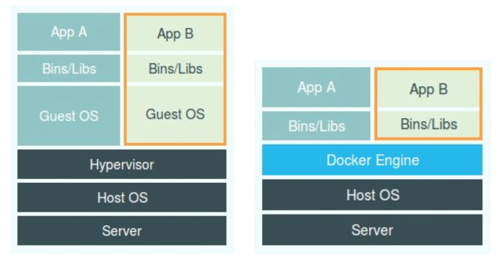

---
tags: [k8s, 容器, cgroups]
created: 2026-01-29
---

# 深入理解K8s-03-隔离与限制(Cgroups)

## 💡 核心观点
> Cgroups是Linux内核用于限制进程组资源使用的技术，弥补了Namespace只能隔离视图、无法限制资源的不足。

## 📝 详细笔记

### 1. 容器与虚拟机的架构对比与优势

- **架构定位的修正**：Docker Engine(或任何容器管理工具)不应与Hypervisor放在同等位置。容器里的应用进程与宿主机上的其他进程一样，都由宿主机操作系统统一管理，只是拥有额外的Namespace参数设置。Docker扮演的是旁路的辅助和管理角色。

- **容器相对优势**：
  * 高性能：由于容器是宿主机上的普通进程，消除了Hypervisor拦截和处理带来的虚拟化性能损耗(尤其在计算、网络、磁盘I/O方面)。
  * 敏捷性(轻量级)：无需运行完整的Guest OS，容器的额外资源占用几乎可以忽略不计(VM启动需要占用100-200MB内存)。

### 2. Linux Namespace隔离的不足之处(劣势)

虽然Namespace提供了隔离，但相比于虚拟机，其隔离性存在不足：

1. 内核共享
2. 隔离不彻底
3. 安全攻击面大

### 3. 容器的资源"限制"即使：Cgroups

- **限制的必要性**：尽管有了Namespace隔离，但容器进程在宿主机上与其他进程仍然是平等的竞争关系。如果不加限制，一个容器进程可能会占用所有资源，影响其他进程(包括其他容器)。
- **技术名称**：Linux Cgroups(Control Group)。
- **核心作用**：限制一个进程组能够使用的资源上限，包括CPU、内存、磁盘I/O、网络带宽等。

**Cgroups的工作原理与实践**

1. 文件系统接口：Cgroups通过文件目录的方式组织在操作系统的/sys/fs/cgroup路径下。
2. 子系统(Subsystem)：/sys/fs/cgroup下的子目录(如cpu、memory、blkio等)代表了可以被限制的资源种类。
3. 控制组(Control Group)：在子系统目录下创建一个目录(例如mkdir container)，这个新目录就是一个"控制组"。系统会自动生成该子系统对应的资源限制文件。
4. 设置限制：通过修改控制组目录下的资源限制文件来设置资源上限：
  a. 例如，在/sys/fs/cgroup/container 中设置cpu.cfs_quata_us和cpu.cfs_period_us，可以限制CPU使用比例。
5. 进程归属：将被限制的进程PID写入控制目录下的tasks文件，限制即生效。

### 4. 容器中的重要概念与遗留问题

- **容器的本质**：一个正在运行的Docker容器，就是一个启用了多个Linux Namespace的应用进程，而这个进程能使用的资源量则受Cgroups配置的限制。
- **容器的"但进程"模型**：容器本质上是一个进程，用户的应用进程通常就是容器里PID=1的进程：
  * 设计期望：容器和应用能够同生命周期。
  * 问题：容器内不适合同时运行两个不相关的应用，如果需要运行多个应用，需要使用systemd/supervisord等作为PID=1的父进程(但更推荐使用容器设计模式)。
- **Cgroups的不完善**：/proc文件系统问题：
  * 问题现象：在容器执行top命令查看的其实是/proc目录下的文件，所以显示的是宿主机的CPU和内存数据，而不是当前容器的限制数据。
  * 原因：/proc文件系统不了解Cgroups限制的存在。
  * 解决方案：lxcfs等工具通过FUSE文件系统模拟出正确的/proc信息，供容器内应用读取。

## 🔗 关联思考
- 相关课题：[[深入理解K8s-04-深入理解容器镜像与rootfs]]
- 技术对比：隔离(Namespace) vs 限制(Cgroups)

## 📚 系列导航
- 上一篇：[[深入理解K8s-02-容器与虚拟机的对比]]
- 下一篇：[[深入理解K8s-04-深入理解容器镜像与rootfs]]
