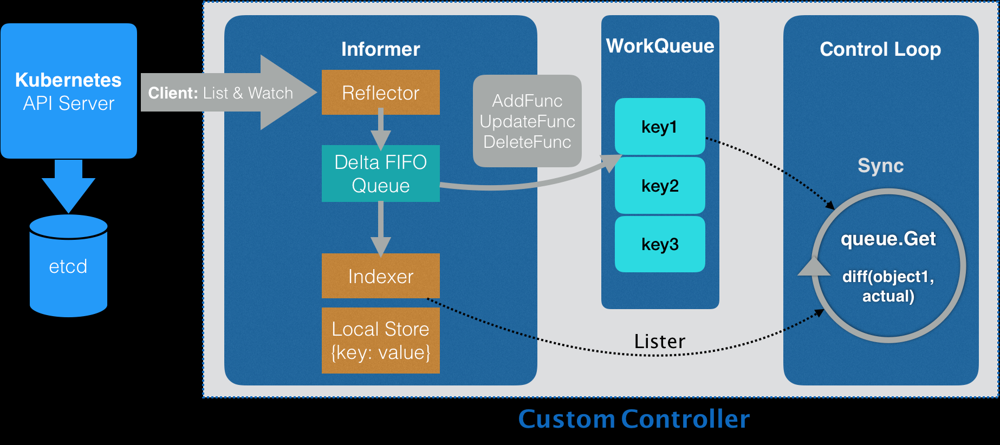

---
tags: [k8s, 控制器, informer, 自定义]
created: 2026-01-29
---

# 深入理解K8s-20-Kubernetes自定义控制器(CustomController)深度笔记

## 💡 核心观点
> 自定义控制器通过Informer机制高效监听API资源变化，利用本地缓存减少API Server压力，通过工作队列实现解耦和容错，是实现Kubernetes编程范式的核心技术。

## 📝 详细笔记

### 1. 核心哲学：声明式API与控制循环

Kubernetes的本质是一个状态协调器。

- **期望状态(Desired State)**：用户通过YAML提交给API Server的对象。
- **实际状态(Actual State)**：集群中物理资源的真实情况(如Neutron中的网络、云上的负载均衡等)。
- **控制循环(Control Loop)**：控制器的核心逻辑，即不断对比"期望"与"实际"，如果不一致，则执行草哟使其趋向一致。

### 2. 关键组件：Informer机制

Informer是链接API Server与控制器的桥梁，其设计目标是高效、异步、减压。

1. **Reflector(反射器)**：通过`ListAndWatch`接口从API Server获取数据：
  a. List：启动时获取所有对象的最新版本。
  b. Watch：之后通过长连接实时监听对象的变化(Added,Updated,Deleted)。

2. **Delta FIFO Queue(增量队列)**：存储Reflector捕获到的变化事件(成为Delta)。

3. **Indexer & Local Store(本地缓存)**：Informer会将对象缓存到本地内存中：
  a. 优点：控制器查询对象时直接访问内存，无需高频请求API Server，极大地降低了Master节点压力。

4. **ResourceEventHandler(时间回调)**：开发人员注册 `Add/Update/Delete`方法，将受影响对象的key(`<namespace>/<name>`)推入工作队列。

### 3. 编写控制器的三部曲

1. **初始化(Main函数)**：
  a. 创建Clientset：初始化与API Server通信的客户端。
  b. 启动Infromer Factory：为特定的API对象(如NetWork或Deployment)创建Informer。
  c. 示例化Controller：将Informer传递给自定义控制器。

2. **注册Handler与同步本地缓存**：
  a. 在创建控制器时向Informer中注册回调函数。
  b. 注意：入队的是Key而非对象本身。这保证了即使处理速度慢，控制循环拿到的永远是本地缓存里最新的对象状态。

3. **执行控制循环(SyncHandler)**：
  a. 从WorkQueue获取Key。
  b. 使用Key从Lister(本地缓存)获取期望对象。
  c. 调用外部API(如Neutron API)获取实际资源状态。
  d. 对比与操作：
    - 不存在则创建
    - 存在但配置不符则更新
    - 若缓存中已不存在该Key对应的对象，则从外部环境删除物理资源。

### 4. 思考题

**为什么Informer和控制循环之间要加一个工作队列**：

- **解耦与限速**：内部Informer是时间产生速度可能极快，而外部API(如创建云网络)可能很慢。工作队列起到缓冲作用。
- **去重与合并**：如果一个对象短时间内更新了10次，队列可以保证控制循环只处理最终状态，避免无效的中间操作。
- **错误重试**：如果某次协调失败，可以将Key重新入队，利用队列的延迟重试机制进行容错。

## 🔗 关联思考
- 相关课题：[[深入理解K8s-21-KubernetesRBAC文章的核心是一个实战]]
- 实践技巧：如何优化控制器性能

## 📚 系列导航
- 上一篇：[[深入理解K8s-19-深入解析API对象的奥秘]]
- 下一篇：[[深入理解K8s-21-KubernetesRBAC文章的核心是一个实战]]
